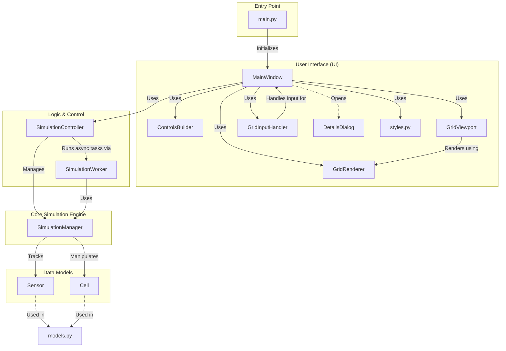
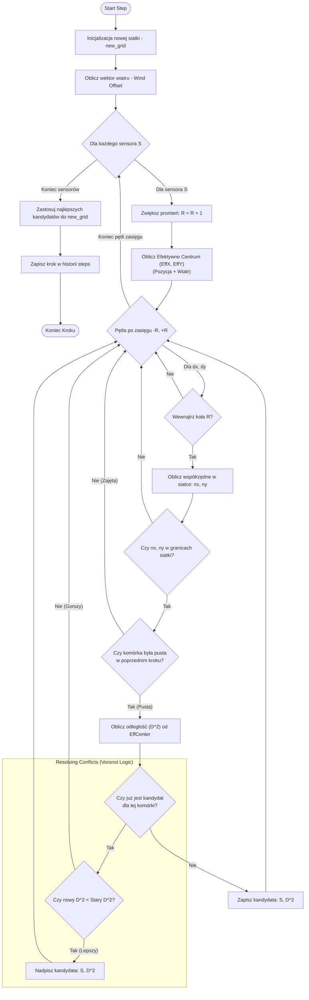

# Schema Struktury i Algorytmu Symulatora Voronoi

Poniżej znajdują się diagrama blokowa struktury projektu oraz schemat blokowy (FlowChart) algorytmu symulacji.

## 1. Diagram Blokowy Struktury Projektu (Block Diagram)

Przedstawia główne komponenty aplikacji i ich relacje.

## 2. Schemat Blokowy Algorytmu (FlowChart)

Przedstawia logikę pojedynczego kroku symulacji (`next_step`), w tym mechanizm wzrostu i wpływu wiatru.

