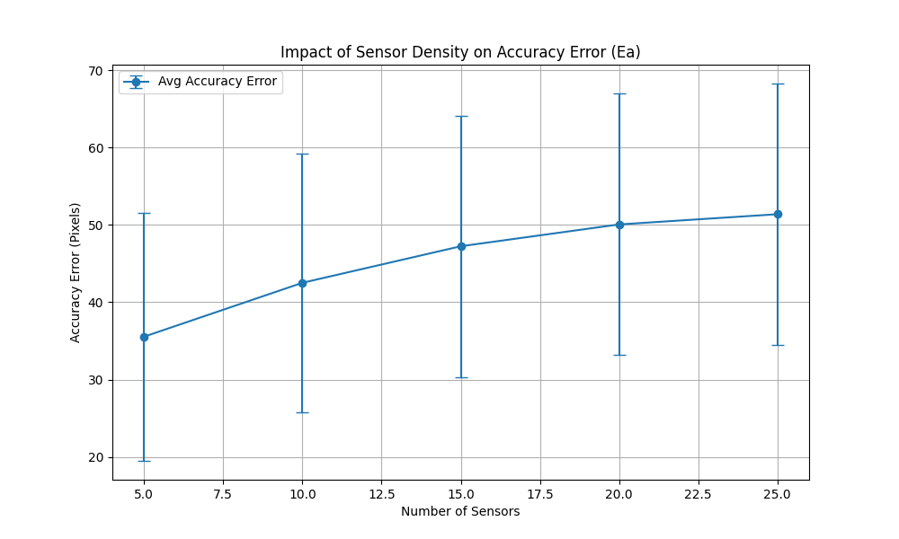
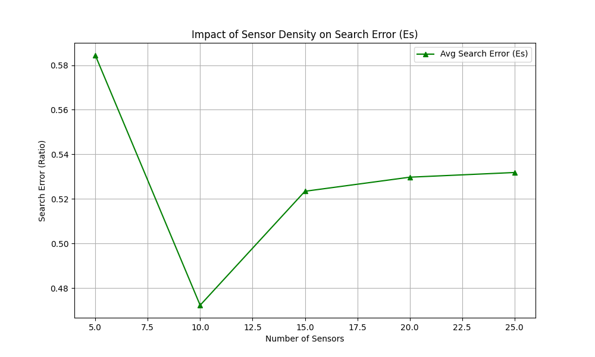
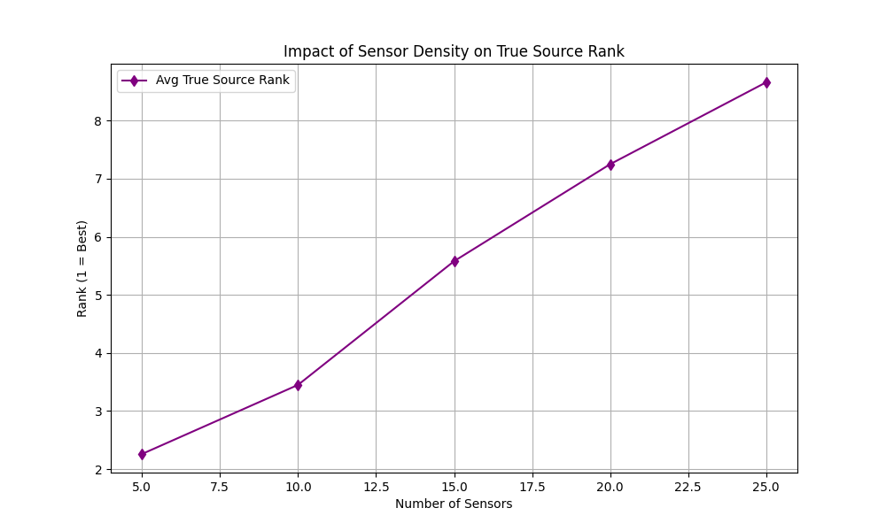

# Report of Automated Tests (Files 1-100)

## Data: Test_001.csv

### Configuration: uniform_10_sensors.json
- **Ec**: 0.2176, **Es**: 0.9064, **Rank**: 8, **Ea**: 70.69509093329513, **Rel**: 0, **Max**: 6.6200e-07

### Configuration: uniform_15_sensors.json
- **Ec**: 0.1584, **Es**: 0.7209, **Rank**: 8, **Ea**: 76.56930303755158, **Rel**: 0, **Max**: 8.7600e-06

### Configuration: uniform_20_sensors.json
- **Ec**: 0.1280, **Es**: 0.8420, **Rank**: 13, **Ea**: 79.81563705190135, **Rel**: 0, **Max**: 8.7600e-06

### Configuration: uniform_25_sensors.json
- **Ec**: 0.1152, **Es**: 0.8848, **Rank**: 17, **Ea**: 81.29869731812063, **Rel**: 0, **Max**: 8.7600e-06

### Configuration: uniform_5_sensors.json
- **Ec**: 0.3627, **Es**: 0.7500, **Rank**: 3, **Ea**: 64.09485371908414, **Rel**: 0, **Max**: 4.1700e-07

## Data: Test_002.csv

### Configuration: uniform_10_sensors.json
- **Ec**: 0.2166, **Es**: 0.4446, **Rank**: 3, **Ea**: 54.7915675596797, **Rel**: 0, **Max**: 1.0000e-06

### Configuration: uniform_15_sensors.json
- **Ec**: 0.1591, **Es**: 0.6841, **Rank**: 8, **Ea**: 57.84143992619291, **Rel**: 0, **Max**: 1.3300e-05

### Configuration: uniform_20_sensors.json
- **Ec**: 0.1295, **Es**: 0.5320, **Rank**: 7, **Ea**: 59.632856617774024, **Rel**: 0, **Max**: 1.3300e-05

### Configuration: uniform_25_sensors.json
- **Ec**: 0.1116, **Es**: 0.4496, **Rank**: 7, **Ea**: 61.041273871935765, **Rel**: 0, **Max**: 1.3300e-05

### Configuration: uniform_5_sensors.json
- **Ec**: 0.3555, **Es**: 0.6900, **Rank**: 3, **Ea**: 44.519162144646025, **Rel**: 0, **Max**: 6.3100e-07

## Data: Test_003.csv

### Configuration: uniform_10_sensors.json
- **Ec**: 0.1911, **Es**: 0.2891, **Rank**: 2, **Ea**: 20.73889194286918, **Rel**: 0, **Max**: 1.1600e-06

### Configuration: uniform_15_sensors.json
- **Ec**: 0.1482, **Es**: 0.2242, **Rank**: 2, **Ea**: 20.974302059352766, **Rel**: 0, **Max**: 1.5300e-05

### Configuration: uniform_20_sensors.json
- **Ec**: 0.1178, **Es**: 0.1798, **Rank**: 2, **Ea**: 22.328811207243753, **Rel**: 0, **Max**: 1.5300e-05

### Configuration: uniform_25_sensors.json
- **Ec**: 0.1064, **Es**: 0.1624, **Rank**: 2, **Ea**: 22.8528753567705, **Rel**: 0, **Max**: 1.5300e-05

### Configuration: uniform_5_sensors.json
- **Ec**: 0.3192, **Es**: 0.3192, **Rank**: 1, **Ea**: 9.318304932723901, **Rel**: 1, **Max**: 7.3000e-07

## Data: Test_004.csv

### Configuration: uniform_10_sensors.json
- **Ec**: 0.2040, **Es**: 0.3400, **Rank**: 2, **Ea**: 36.4529050334046, **Rel**: 0, **Max**: 8.5100e-07

### Configuration: uniform_15_sensors.json
- **Ec**: 0.1456, **Es**: 0.6784, **Rank**: 7, **Ea**: 43.92371385828997, **Rel**: 0, **Max**: 1.1300e-05

### Configuration: uniform_20_sensors.json
- **Ec**: 0.1161, **Es**: 0.4916, **Rank**: 6, **Ea**: 48.183189641800276, **Rel**: 0, **Max**: 1.1300e-05

### Configuration: uniform_25_sensors.json
- **Ec**: 0.1053, **Es**: 0.6180, **Rank**: 10, **Ea**: 49.99971556326765, **Rel**: 0, **Max**: 1.1300e-05

### Configuration: uniform_5_sensors.json
- **Ec**: 0.3385, **Es**: 0.7900, **Rank**: 3, **Ea**: 34.66571557160277, **Rel**: 0, **Max**: 5.3600e-07

## Data: Test_005.csv

### Configuration: uniform_10_sensors.json
- **Ec**: 0.1911, **Es**: 0.1911, **Rank**: 1, **Ea**: 17.760638238989888, **Rel**: 1, **Max**: 1.7500e-07

### Configuration: uniform_15_sensors.json
- **Ec**: 0.1482, **Es**: 0.1482, **Rank**: 1, **Ea**: 17.963851181341013, **Rel**: 1, **Max**: 2.3100e-06

### Configuration: uniform_20_sensors.json
- **Ec**: 0.1216, **Es**: 0.1216, **Rank**: 1, **Ea**: 19.236605955315028, **Rel**: 1, **Max**: 2.3100e-06

### Configuration: uniform_25_sensors.json
- **Ec**: 0.1073, **Es**: 0.1653, **Rank**: 2, **Ea**: 20.24633684760828, **Rel**: 0, **Max**: 2.3100e-06

### Configuration: uniform_5_sensors.json
- **Ec**: 0.3192, **Es**: 0.3192, **Rank**: 1, **Ea**: 6.414346997500058, **Rel**: 1, **Max**: 1.1000e-07

## Data: Test_006.csv

### Configuration: uniform_10_sensors.json
- **Ec**: 0.1972, **Es**: 0.3332, **Rank**: 2, **Ea**: 32.21470420553613, **Rel**: 0, **Max**: 1.1800e-06

### Configuration: uniform_15_sensors.json
- **Ec**: 0.1404, **Es**: 0.6751, **Rank**: 7, **Ea**: 39.812155250723315, **Rel**: 0, **Max**: 1.5600e-05

### Configuration: uniform_20_sensors.json
- **Ec**: 0.1161, **Es**: 0.4916, **Rank**: 6, **Ea**: 43.942748686383254, **Rel**: 0, **Max**: 1.5600e-05

### Configuration: uniform_25_sensors.json
- **Ec**: 0.1040, **Es**: 0.6240, **Rank**: 10, **Ea**: 45.520619993038835, **Rel**: 0, **Max**: 1.5600e-05

### Configuration: uniform_5_sensors.json
- **Ec**: 0.3315, **Es**: 0.3315, **Rank**: 1, **Ea**: 31.15420103282274, **Rel**: 1, **Max**: 7.4200e-07

## Data: Test_007.csv

### Configuration: uniform_10_sensors.json
- **Ec**: 0.2242, **Es**: 0.3422, **Rank**: 2, **Ea**: 36.89150721708588, **Rel**: 0, **Max**: 1.0100e-06

### Configuration: uniform_15_sensors.json
- **Ec**: 0.1584, **Es**: 0.2464, **Rank**: 2, **Ea**: 41.17021487645212, **Rel**: 0, **Max**: 1.3300e-05

### Configuration: uniform_20_sensors.json
- **Ec**: 0.1295, **Es**: 0.4890, **Rank**: 6, **Ea**: 43.50191355989894, **Rel**: 0, **Max**: 1.3300e-05

### Configuration: uniform_25_sensors.json
- **Ec**: 0.1155, **Es**: 0.4235, **Rank**: 6, **Ea**: 44.67650963398149, **Rel**: 0, **Max**: 1.3300e-05

### Configuration: uniform_5_sensors.json
- **Ec**: 0.3627, **Es**: 0.3627, **Rank**: 1, **Ea**: 27.58027942922759, **Rel**: 1, **Max**: 6.3300e-07

## Data: Test_008.csv

### Configuration: uniform_10_sensors.json
- **Ec**: 0.2220, **Es**: 0.3420, **Rank**: 2, **Ea**: 36.00700996118046, **Rel**: 0, **Max**: 9.1000e-07

### Configuration: uniform_15_sensors.json
- **Ec**: 0.1610, **Es**: 0.6415, **Rank**: 7, **Ea**: 40.632812448157175, **Rel**: 0, **Max**: 1.2000e-05

### Configuration: uniform_20_sensors.json
- **Ec**: 0.1292, **Es**: 0.4922, **Rank**: 6, **Ea**: 43.517478787736025, **Rel**: 0, **Max**: 1.2000e-05

### Configuration: uniform_25_sensors.json
- **Ec**: 0.1156, **Es**: 0.4276, **Rank**: 6, **Ea**: 44.84095949254065, **Rel**: 0, **Max**: 1.2000e-05

### Configuration: uniform_5_sensors.json
- **Ec**: 0.3631, **Es**: 0.3631, **Rank**: 1, **Ea**: 27.610899442107694, **Rel**: 1, **Max**: 5.7300e-07

## Data: Test_009.csv

### Configuration: uniform_10_sensors.json
- **Ec**: 0.2232, **Es**: 0.4712, **Rank**: 3, **Ea**: 54.18927586072452, **Rel**: 0, **Max**: 3.0400e-07

### Configuration: uniform_15_sensors.json
- **Ec**: 0.1598, **Es**: 0.7142, **Rank**: 8, **Ea**: 59.47971938600736, **Rel**: 0, **Max**: 4.0200e-06

### Configuration: uniform_20_sensors.json
- **Ec**: 0.1292, **Es**: 0.5422, **Rank**: 7, **Ea**: 62.43497788691179, **Rel**: 0, **Max**: 4.0200e-06

### Configuration: uniform_25_sensors.json
- **Ec**: 0.1155, **Es**: 0.7480, **Rank**: 13, **Ea**: 63.8232829064199, **Rel**: 0, **Max**: 4.0200e-06

### Configuration: uniform_5_sensors.json
- **Ec**: 0.3695, **Es**: 0.7400, **Rank**: 3, **Ea**: 46.182841410908225, **Rel**: 0, **Max**: 1.9100e-07

## Data: Test_010.csv

### Configuration: uniform_10_sensors.json
- **Ec**: 0.2077, **Es**: 0.8383, **Rank**: 7, **Ea**: 56.12908519359901, **Rel**: 0, **Max**: 7.7300e-07

### Configuration: uniform_15_sensors.json
- **Ec**: 0.1530, **Es**: 0.7410, **Rank**: 8, **Ea**: 62.94582243268258, **Rel**: 0, **Max**: 1.0200e-05

### Configuration: uniform_20_sensors.json
- **Ec**: 0.1218, **Es**: 0.8382, **Rank**: 13, **Ea**: 67.01146511013292, **Rel**: 0, **Max**: 1.0200e-05

### Configuration: uniform_25_sensors.json
- **Ec**: 0.1102, **Es**: 0.7540, **Rank**: 13, **Ea**: 68.72317663096214, **Rel**: 0, **Max**: 1.0200e-05

### Configuration: uniform_5_sensors.json
- **Ec**: 0.3537, **Es**: 0.7800, **Rank**: 3, **Ea**: 52.164428659881544, **Rel**: 0, **Max**: 4.8700e-07

## Data: Test_011.csv

### Configuration: uniform_10_sensors.json
- **Ec**: 0.2183, **Es**: 0.2183, **Rank**: 1, **Ea**: 17.12702442255508, **Rel**: 1, **Max**: 8.9900e-07

### Configuration: uniform_15_sensors.json
- **Ec**: 0.1610, **Es**: 0.1610, **Rank**: 1, **Ea**: 21.22279690597708, **Rel**: 1, **Max**: 1.1900e-05

### Configuration: uniform_20_sensors.json
- **Ec**: 0.1326, **Es**: 0.2106, **Rank**: 2, **Ea**: 23.863592215902965, **Rel**: 0, **Max**: 1.1900e-05

### Configuration: uniform_25_sensors.json
- **Ec**: 0.1155, **Es**: 0.4315, **Rank**: 6, **Ea**: 25.619676766087238, **Rel**: 0, **Max**: 1.1900e-05

### Configuration: uniform_5_sensors.json
- **Ec**: 0.3630, **Es**: 0.3630, **Rank**: 1, **Ea**: 8.368138001080867, **Rel**: 1, **Max**: 5.6600e-07

## Data: Test_012.csv

### Configuration: uniform_10_sensors.json
- **Ec**: 0.1863, **Es**: 0.1863, **Rank**: 1, **Ea**: 20.638686270599244, **Rel**: 1, **Max**: 2.8900e-07

### Configuration: uniform_15_sensors.json
- **Ec**: 0.1325, **Es**: 0.1325, **Rank**: 1, **Ea**: 28.445866285223577, **Rel**: 1, **Max**: 3.8200e-06

### Configuration: uniform_20_sensors.json
- **Ec**: 0.1100, **Es**: 0.4365, **Rank**: 5, **Ea**: 32.72481772137582, **Rel**: 0, **Max**: 3.8200e-06

### Configuration: uniform_25_sensors.json
- **Ec**: 0.1000, **Es**: 0.3900, **Rank**: 5, **Ea**: 34.644558332999225, **Rel**: 0, **Max**: 3.8200e-06

### Configuration: uniform_5_sensors.json
- **Ec**: 0.3085, **Es**: 0.3085, **Rank**: 1, **Ea**: 21.66699374537081, **Rel**: 1, **Max**: 1.8200e-07

## Data: Test_013.csv

### Configuration: uniform_10_sensors.json
- **Ec**: 0.2220, **Es**: 0.2220, **Rank**: 1, **Ea**: 12.02463113598069, **Rel**: 1, **Max**: 3.9400e-07

### Configuration: uniform_15_sensors.json
- **Ec**: 0.1584, **Es**: 0.1584, **Rank**: 1, **Ea**: 17.201824943296565, **Rel**: 1, **Max**: 5.2100e-06

### Configuration: uniform_20_sensors.json
- **Ec**: 0.1280, **Es**: 0.1280, **Rank**: 1, **Ea**: 20.463753124173856, **Rel**: 1, **Max**: 5.2100e-06

### Configuration: uniform_25_sensors.json
- **Ec**: 0.1147, **Es**: 0.1147, **Rank**: 1, **Ea**: 21.945226104622186, **Rel**: 1, **Max**: 5.2100e-06

### Configuration: uniform_5_sensors.json
- **Ec**: 0.3615, **Es**: 0.3615, **Rank**: 1, **Ea**: 5.0836864361590415, **Rel**: 1, **Max**: 2.4800e-07

## Data: Test_014.csv

### Configuration: uniform_10_sensors.json
- **Ec**: 0.2106, **Es**: 0.4266, **Rank**: 3, **Ea**: 39.358869061179895, **Rel**: 0, **Max**: 8.0700e-07

### Configuration: uniform_15_sensors.json
- **Ec**: 0.1520, **Es**: 0.3120, **Rank**: 3, **Ea**: 41.37041887844781, **Rel**: 0, **Max**: 1.0700e-05

### Configuration: uniform_20_sensors.json
- **Ec**: 0.1216, **Es**: 0.2496, **Rank**: 3, **Ea**: 42.73028525981555, **Rel**: 0, **Max**: 1.0700e-05

### Configuration: uniform_25_sensors.json
- **Ec**: 0.1073, **Es**: 0.4353, **Rank**: 7, **Ea**: 43.78087935964443, **Rel**: 0, **Max**: 1.0700e-05

### Configuration: uniform_5_sensors.json
- **Ec**: 0.3411, **Es**: 0.3411, **Rank**: 1, **Ea**: 28.455060684539813, **Rel**: 1, **Max**: 5.0800e-07

## Data: Test_015.csv

### Configuration: uniform_10_sensors.json
- **Ec**: 0.2210, **Es**: 0.9090, **Rank**: 8, **Ea**: 56.09453357574367, **Rel**: 0, **Max**: 7.3300e-07

### Configuration: uniform_15_sensors.json
- **Ec**: 0.1568, **Es**: 0.7276, **Rank**: 8, **Ea**: 62.449924251460175, **Rel**: 0, **Max**: 9.7000e-06

### Configuration: uniform_20_sensors.json
- **Ec**: 0.1280, **Es**: 0.8420, **Rank**: 13, **Ea**: 65.82469519927238, **Rel**: 0, **Max**: 9.7000e-06

### Configuration: uniform_25_sensors.json
- **Ec**: 0.1152, **Es**: 0.7520, **Rank**: 13, **Ea**: 67.36682691631113, **Rel**: 0, **Max**: 9.7000e-06

### Configuration: uniform_5_sensors.json
- **Ec**: 0.3622, **Es**: 0.7600, **Rank**: 3, **Ea**: 50.18526558494783, **Rel**: 0, **Max**: 4.6200e-07

## Data: Test_016.csv

### Configuration: uniform_10_sensors.json
- **Ec**: 0.2205, **Es**: 0.9075, **Rank**: 8, **Ea**: 56.542510303966445, **Rel**: 0, **Max**: 5.4500e-07

### Configuration: uniform_15_sensors.json
- **Ec**: 0.1632, **Es**: 0.7242, **Rank**: 8, **Ea**: 61.764758046515325, **Rel**: 0, **Max**: 7.2200e-06

### Configuration: uniform_20_sensors.json
- **Ec**: 0.1287, **Es**: 0.8413, **Rank**: 13, **Ea**: 65.25429579066153, **Rel**: 0, **Max**: 7.2200e-06

### Configuration: uniform_25_sensors.json
- **Ec**: 0.1155, **Es**: 0.7480, **Rank**: 13, **Ea**: 66.69221224492196, **Rel**: 0, **Max**: 7.2200e-06

### Configuration: uniform_5_sensors.json
- **Ec**: 0.3693, **Es**: 0.7500, **Rank**: 3, **Ea**: 49.059107276073966, **Rel**: 0, **Max**: 3.4400e-07

## Data: Test_017.csv

### Configuration: uniform_10_sensors.json
- **Ec**: 0.1950, **Es**: 0.3950, **Rank**: 3, **Ea**: 55.46312477532532, **Rel**: 0, **Max**: 9.8800e-07

### Configuration: uniform_15_sensors.json
- **Ec**: 0.1404, **Es**: 0.2844, **Rank**: 3, **Ea**: 55.74474243839732, **Rel**: 0, **Max**: 1.3100e-05

### Configuration: uniform_20_sensors.json
- **Ec**: 0.1092, **Es**: 0.2212, **Rank**: 3, **Ea**: 56.297179027756144, **Rel**: 0, **Max**: 1.3100e-05

### Configuration: uniform_25_sensors.json
- **Ec**: 0.0975, **Es**: 0.1975, **Rank**: 3, **Ea**: 56.57590819282723, **Rel**: 0, **Max**: 1.3100e-05

### Configuration: uniform_5_sensors.json
- **Ec**: 0.3123, **Es**: 0.4239, **Rank**: 2, **Ea**: 44.071962770925275, **Rel**: 0, **Max**: 6.2200e-07

## Data: Test_018.csv

### Configuration: uniform_10_sensors.json
- **Ec**: 0.2183, **Es**: 0.4543, **Rank**: 3, **Ea**: 58.84153744452433, **Rel**: 0, **Max**: 1.3700e-07

### Configuration: uniform_15_sensors.json
- **Ec**: 0.1584, **Es**: 0.6908, **Rank**: 8, **Ea**: 62.840858134751066, **Rel**: 0, **Max**: 1.8100e-06

### Configuration: uniform_20_sensors.json
- **Ec**: 0.1296, **Es**: 0.5356, **Rank**: 7, **Ea**: 65.00775960091659, **Rel**: 0, **Max**: 1.8100e-06

### Configuration: uniform_25_sensors.json
- **Ec**: 0.1155, **Es**: 0.7400, **Rank**: 13, **Ea**: 66.27294089429812, **Rel**: 0, **Max**: 1.8100e-06

### Configuration: uniform_5_sensors.json
- **Ec**: 0.3627, **Es**: 0.7100, **Rank**: 3, **Ea**: 49.24442889537253, **Rel**: 0, **Max**: 8.6000e-08

## Data: Test_019.csv

### Configuration: uniform_10_sensors.json
- **Ec**: 0.2205, **Es**: 0.9075, **Rank**: 8, **Ea**: 63.841959171979596, **Rel**: 0, **Max**: 7.1000e-07

### Configuration: uniform_15_sensors.json
- **Ec**: 0.1598, **Es**: 0.7142, **Rank**: 8, **Ea**: 69.12906748598353, **Rel**: 0, **Max**: 9.3900e-06

### Configuration: uniform_20_sensors.json
- **Ec**: 0.1326, **Es**: 0.8474, **Rank**: 13, **Ea**: 71.77802275773512, **Rel**: 0, **Max**: 9.3900e-06

### Configuration: uniform_25_sensors.json
- **Ec**: 0.1155, **Es**: 0.7480, **Rank**: 13, **Ea**: 73.51008027667011, **Rel**: 0, **Max**: 9.3900e-06

### Configuration: uniform_5_sensors.json
- **Ec**: 0.3695, **Es**: 0.7400, **Rank**: 3, **Ea**: 55.86913990243092, **Rel**: 0, **Max**: 4.4700e-07

## Data: Test_020.csv

### Configuration: uniform_10_sensors.json
- **Ec**: 0.2166, **Es**: 0.3306, **Rank**: 2, **Ea**: 25.59177265498694, **Rel**: 0, **Max**: 8.8800e-07

### Configuration: uniform_15_sensors.json
- **Ec**: 0.1584, **Es**: 0.2464, **Rank**: 2, **Ea**: 29.121617341721493, **Rel**: 0, **Max**: 1.1800e-05

### Configuration: uniform_20_sensors.json
- **Ec**: 0.1260, **Es**: 0.1980, **Rank**: 2, **Ea**: 31.68478967411375, **Rel**: 0, **Max**: 1.1800e-05

### Configuration: uniform_25_sensors.json
- **Ec**: 0.1155, **Es**: 0.4235, **Rank**: 6, **Ea**: 32.57315962429883, **Rel**: 0, **Max**: 1.1800e-05

### Configuration: uniform_5_sensors.json
- **Ec**: 0.3627, **Es**: 0.3627, **Rank**: 1, **Ea**: 15.5017569586116, **Rel**: 1, **Max**: 5.5900e-07

## Data: Test_021.csv

### Configuration: uniform_10_sensors.json
- **Ec**: 0.1989, **Es**: 0.3009, **Rank**: 2, **Ea**: 32.96751709470429, **Rel**: 0, **Max**: 1.1400e-06

### Configuration: uniform_15_sensors.json
- **Ec**: 0.1482, **Es**: 0.2242, **Rank**: 2, **Ea**: 33.607854115180096, **Rel**: 0, **Max**: 1.5000e-05

### Configuration: uniform_20_sensors.json
- **Ec**: 0.1178, **Es**: 0.1798, **Rank**: 2, **Ea**: 34.93794986938687, **Rel**: 0, **Max**: 1.5000e-05

### Configuration: uniform_25_sensors.json
- **Ec**: 0.1064, **Es**: 0.1624, **Rank**: 2, **Ea**: 35.397714461745096, **Rel**: 0, **Max**: 1.5000e-05

### Configuration: uniform_5_sensors.json
- **Ec**: 0.3261, **Es**: 0.3261, **Rank**: 1, **Ea**: 21.45744546668268, **Rel**: 1, **Max**: 7.1600e-07

## Data: Test_022.csv

### Configuration: uniform_10_sensors.json
- **Ec**: 0.2077, **Es**: 0.2077, **Rank**: 1, **Ea**: 24.111033622735988, **Rel**: 1, **Max**: 2.1000e-07

### Configuration: uniform_15_sensors.json
- **Ec**: 0.1479, **Es**: 0.6717, **Rank**: 7, **Ea**: 31.369613368793914, **Rel**: 0, **Max**: 2.7800e-06

### Configuration: uniform_20_sensors.json
- **Ec**: 0.1204, **Es**: 0.4984, **Rank**: 6, **Ea**: 35.13058486821801, **Rel**: 0, **Max**: 2.7800e-06

### Configuration: uniform_25_sensors.json
- **Ec**: 0.1092, **Es**: 0.4392, **Rank**: 6, **Ea**: 36.923707528436005, **Rel**: 0, **Max**: 2.7800e-06

### Configuration: uniform_5_sensors.json
- **Ec**: 0.3385, **Es**: 0.3385, **Rank**: 1, **Ea**: 21.755332350251244, **Rel**: 1, **Max**: 1.3200e-07

## Data: Test_023.csv

### Configuration: uniform_10_sensors.json
- **Ec**: 0.2176, **Es**: 0.9064, **Rank**: 8, **Ea**: 72.68443234207045, **Rel**: 0, **Max**: 9.8300e-07

### Configuration: uniform_15_sensors.json
- **Ec**: 0.1584, **Es**: 0.8876, **Rank**: 11, **Ea**: 78.3760148023554, **Rel**: 0, **Max**: 1.3000e-05

### Configuration: uniform_20_sensors.json
- **Ec**: 0.1287, **Es**: 0.9528, **Rank**: 17, **Ea**: 81.55350795619256, **Rel**: 0, **Max**: 1.3000e-05

### Configuration: uniform_25_sensors.json
- **Ec**: 0.1188, **Es**: 0.9612, **Rank**: 21, **Ea**: 82.63998012169819, **Rel**: 0, **Max**: 1.3000e-05

### Configuration: uniform_5_sensors.json
- **Ec**: 0.3693, **Es**: 0.7500, **Rank**: 3, **Ea**: 65.37493546641372, **Rel**: 0, **Max**: 6.1900e-07

## Data: Test_024.csv

### Configuration: uniform_10_sensors.json
- **Ec**: 0.1989, **Es**: 0.1989, **Rank**: 1, **Ea**: 7.87859539243118, **Rel**: 1, **Max**: 4.1200e-07

### Configuration: uniform_15_sensors.json
- **Ec**: 0.1591, **Es**: 0.1591, **Rank**: 1, **Ea**: 9.765147544162016, **Rel**: 1, **Max**: 5.4500e-06

### Configuration: uniform_20_sensors.json
- **Ec**: 0.1295, **Es**: 0.1295, **Rank**: 1, **Ea**: 12.145437262592067, **Rel**: 1, **Max**: 5.4500e-06

### Configuration: uniform_25_sensors.json
- **Ec**: 0.1156, **Es**: 0.1156, **Rank**: 1, **Ea**: 13.456909606953339, **Rel**: 1, **Max**: 5.4500e-06

### Configuration: uniform_5_sensors.json
- **Ec**: 0.3627, **Es**: 0.3627, **Rank**: 1, **Ea**: 3.8591567788256125, **Rel**: 1, **Max**: 2.5900e-07

## Data: Test_025.csv

### Configuration: uniform_10_sensors.json
- **Ec**: 0.2112, **Es**: 0.9048, **Rank**: 8, **Ea**: 56.48525646082157, **Rel**: 0, **Max**: 4.1600e-07

### Configuration: uniform_15_sensors.json
- **Ec**: 0.1550, **Es**: 0.7343, **Rank**: 8, **Ea**: 62.981513624628896, **Rel**: 0, **Max**: 5.5100e-06

### Configuration: uniform_20_sensors.json
- **Ec**: 0.1271, **Es**: 0.8429, **Rank**: 13, **Ea**: 66.61959741278281, **Rel**: 0, **Max**: 5.5100e-06

### Configuration: uniform_25_sensors.json
- **Ec**: 0.1140, **Es**: 0.7600, **Rank**: 13, **Ea**: 68.13737958558987, **Rel**: 0, **Max**: 5.5100e-06

### Configuration: uniform_5_sensors.json
- **Ec**: 0.3615, **Es**: 0.7700, **Rank**: 3, **Ea**: 51.368475455000414, **Rel**: 0, **Max**: 2.6200e-07

## Data: Test_026.csv

### Configuration: uniform_10_sensors.json
- **Ec**: 0.2205, **Es**: 0.9075, **Rank**: 8, **Ea**: 67.76610621011679, **Rel**: 0, **Max**: 7.3300e-07

### Configuration: uniform_15_sensors.json
- **Ec**: 0.1598, **Es**: 0.7142, **Rank**: 8, **Ea**: 73.27244745941545, **Rel**: 0, **Max**: 9.7100e-06

### Configuration: uniform_20_sensors.json
- **Ec**: 0.1287, **Es**: 0.8413, **Rank**: 13, **Ea**: 76.37210029086224, **Rel**: 0, **Max**: 9.7100e-06

### Configuration: uniform_25_sensors.json
- **Ec**: 0.1155, **Es**: 0.7480, **Rank**: 13, **Ea**: 77.77742495526026, **Rel**: 0, **Max**: 9.7100e-06

### Configuration: uniform_5_sensors.json
- **Ec**: 0.3630, **Es**: 0.7400, **Rank**: 3, **Ea**: 60.520042221930105, **Rel**: 0, **Max**: 4.6200e-07

## Data: Test_027.csv

### Configuration: uniform_10_sensors.json
- **Ec**: 0.1972, **Es**: 0.1972, **Rank**: 1, **Ea**: 27.540711621796962, **Rel**: 1, **Max**: 6.9300e-07

### Configuration: uniform_15_sensors.json
- **Ec**: 0.1404, **Es**: 0.6751, **Rank**: 7, **Ea**: 35.104130650594655, **Rel**: 0, **Max**: 9.1700e-06

### Configuration: uniform_20_sensors.json
- **Ec**: 0.1161, **Es**: 0.4916, **Rank**: 6, **Ea**: 39.229577613529756, **Rel**: 0, **Max**: 9.1700e-06

### Configuration: uniform_25_sensors.json
- **Ec**: 0.1040, **Es**: 0.4360, **Rank**: 6, **Ea**: 40.80744804983465, **Rel**: 0, **Max**: 9.1700e-06

### Configuration: uniform_5_sensors.json
- **Ec**: 0.3315, **Es**: 0.3315, **Rank**: 1, **Ea**: 26.562776622708665, **Rel**: 1, **Max**: 4.3600e-07

## Data: Test_028.csv

### Configuration: uniform_10_sensors.json
- **Ec**: 0.2106, **Es**: 0.4266, **Rank**: 3, **Ea**: 56.001301202658226, **Rel**: 0, **Max**: 3.2700e-07

### Configuration: uniform_15_sensors.json
- **Ec**: 0.1482, **Es**: 0.3042, **Rank**: 3, **Ea**: 58.021653484606, **Rel**: 0, **Max**: 4.3300e-06

### Configuration: uniform_20_sensors.json
- **Ec**: 0.1178, **Es**: 0.4988, **Rank**: 7, **Ea**: 59.20871580091437, **Rel**: 0, **Max**: 4.3300e-06

### Configuration: uniform_25_sensors.json
- **Ec**: 0.1064, **Es**: 0.4304, **Rank**: 7, **Ea**: 59.71688985900979, **Rel**: 0, **Max**: 4.3300e-06

### Configuration: uniform_5_sensors.json
- **Ec**: 0.3343, **Es**: 0.6500, **Rank**: 3, **Ea**: 45.23930197973201, **Rel**: 0, **Max**: 2.0600e-07

## Data: Test_029.csv

### Configuration: uniform_10_sensors.json
- **Ec**: 0.1950, **Es**: 0.2950, **Rank**: 2, **Ea**: 34.997031874607295, **Rel**: 0, **Max**: 1.1700e-06

### Configuration: uniform_15_sensors.json
- **Ec**: 0.1443, **Es**: 0.2183, **Rank**: 2, **Ea**: 35.31674809047908, **Rel**: 0, **Max**: 1.5500e-05

### Configuration: uniform_20_sensors.json
- **Ec**: 0.1140, **Es**: 0.1740, **Rank**: 2, **Ea**: 36.46356444833811, **Rel**: 0, **Max**: 1.5500e-05

### Configuration: uniform_25_sensors.json
- **Ec**: 0.1026, **Es**: 0.1566, **Rank**: 2, **Ea**: 36.84127209715675, **Rel**: 0, **Max**: 1.5500e-05

### Configuration: uniform_5_sensors.json
- **Ec**: 0.3192, **Es**: 0.3192, **Rank**: 1, **Ea**: 23.517522109346302, **Rel**: 1, **Max**: 7.3800e-07

## Data: Test_030.csv

### Configuration: uniform_10_sensors.json
- **Ec**: 0.2204, **Es**: 0.3364, **Rank**: 2, **Ea**: 33.29223941736849, **Rel**: 0, **Max**: 5.3300e-07

### Configuration: uniform_15_sensors.json
- **Ec**: 0.1584, **Es**: 0.2464, **Rank**: 2, **Ea**: 37.22025245837726, **Rel**: 0, **Max**: 7.0500e-06

### Configuration: uniform_20_sensors.json
- **Ec**: 0.1260, **Es**: 0.4795, **Rank**: 6, **Ea**: 39.797579718817055, **Rel**: 0, **Max**: 7.0500e-06

### Configuration: uniform_25_sensors.json
- **Ec**: 0.1155, **Es**: 0.4235, **Rank**: 6, **Ea**: 40.674154511722136, **Rel**: 0, **Max**: 7.0500e-06

### Configuration: uniform_5_sensors.json
- **Ec**: 0.3627, **Es**: 0.3627, **Rank**: 1, **Ea**: 23.611434895508616, **Rel**: 1, **Max**: 3.3600e-07

## Data: Test_031.csv

### Configuration: uniform_10_sensors.json
- **Ec**: 0.2205, **Es**: 0.2205, **Rank**: 1, **Ea**: 19.59469548273321, **Rel**: 1, **Max**: 5.7200e-07

### Configuration: uniform_15_sensors.json
- **Ec**: 0.1568, **Es**: 0.2548, **Rank**: 2, **Ea**: 25.576108809017317, **Rel**: 0, **Max**: 7.5600e-06

### Configuration: uniform_20_sensors.json
- **Ec**: 0.1271, **Es**: 0.5006, **Rank**: 6, **Ea**: 29.019766702246702, **Rel**: 0, **Max**: 7.5600e-06

### Configuration: uniform_25_sensors.json
- **Ec**: 0.1110, **Es**: 0.4330, **Rank**: 6, **Ea**: 30.937340807255218, **Rel**: 0, **Max**: 7.5600e-06

### Configuration: uniform_5_sensors.json
- **Ec**: 0.3547, **Es**: 0.3547, **Rank**: 1, **Ea**: 14.210580361642677, **Rel**: 1, **Max**: 3.6000e-07

## Data: Test_032.csv

### Configuration: uniform_10_sensors.json
- **Ec**: 0.2176, **Es**: 0.9064, **Rank**: 8, **Ea**: 70.75468214989584, **Rel**: 0, **Max**: 7.6200e-07

### Configuration: uniform_15_sensors.json
- **Ec**: 0.1584, **Es**: 0.7209, **Rank**: 8, **Ea**: 76.45538055441797, **Rel**: 0, **Max**: 1.0100e-05

### Configuration: uniform_20_sensors.json
- **Ec**: 0.1287, **Es**: 0.8413, **Rank**: 13, **Ea**: 79.64221578245821, **Rel**: 0, **Max**: 1.0100e-05

### Configuration: uniform_25_sensors.json
- **Ec**: 0.1188, **Es**: 0.8912, **Rank**: 17, **Ea**: 80.73228375983938, **Rel**: 0, **Max**: 1.0100e-05

### Configuration: uniform_5_sensors.json
- **Ec**: 0.3693, **Es**: 0.7500, **Rank**: 3, **Ea**: 63.47054959213524, **Rel**: 0, **Max**: 4.8000e-07

## Data: Test_033.csv

### Configuration: uniform_10_sensors.json
- **Ec**: 0.2166, **Es**: 0.4446, **Rank**: 3, **Ea**: 48.250895364603444, **Rel**: 0, **Max**: 1.4000e-07

### Configuration: uniform_15_sensors.json
- **Ec**: 0.1554, **Es**: 0.3234, **Rank**: 3, **Ea**: 51.27284683712648, **Rel**: 0, **Max**: 1.8600e-06

### Configuration: uniform_20_sensors.json
- **Ec**: 0.1258, **Es**: 0.5223, **Rank**: 7, **Ea**: 53.0134033709403, **Rel**: 0, **Max**: 1.8600e-06

### Configuration: uniform_25_sensors.json
- **Ec**: 0.1116, **Es**: 0.4496, **Rank**: 7, **Ea**: 54.16551195168059, **Rel**: 0, **Max**: 1.8600e-06

### Configuration: uniform_5_sensors.json
- **Ec**: 0.3488, **Es**: 0.6800, **Rank**: 3, **Ea**: 38.00965001515934, **Rel**: 0, **Max**: 8.8400e-08

## Data: Test_034.csv

### Configuration: uniform_10_sensors.json
- **Ec**: 0.2196, **Es**: 0.4636, **Rank**: 3, **Ea**: 58.956218672894714, **Rel**: 0, **Max**: 8.4200e-07

### Configuration: uniform_15_sensors.json
- **Ec**: 0.1610, **Es**: 0.7075, **Rank**: 8, **Ea**: 63.386909105108, **Rel**: 0, **Max**: 1.1100e-05

### Configuration: uniform_20_sensors.json
- **Ec**: 0.1295, **Es**: 0.5390, **Rank**: 7, **Ea**: 66.07702022924238, **Rel**: 0, **Max**: 1.1100e-05

### Configuration: uniform_25_sensors.json
- **Ec**: 0.1156, **Es**: 0.7440, **Rank**: 13, **Ea**: 67.40455463913479, **Rel**: 0, **Max**: 1.1100e-05

### Configuration: uniform_5_sensors.json
- **Ec**: 0.3630, **Es**: 0.7200, **Rank**: 3, **Ea**: 50.19004497273172, **Rel**: 0, **Max**: 5.3000e-07

## Data: Test_035.csv

### Configuration: uniform_10_sensors.json
- **Ec**: 0.2204, **Es**: 0.3364, **Rank**: 2, **Ea**: 29.193446411072344, **Rel**: 0, **Max**: 3.3300e-07

### Configuration: uniform_15_sensors.json
- **Ec**: 0.1584, **Es**: 0.2464, **Rank**: 2, **Ea**: 32.97765490437913, **Rel**: 0, **Max**: 4.4100e-06

### Configuration: uniform_20_sensors.json
- **Ec**: 0.1260, **Es**: 0.4795, **Rank**: 6, **Ea**: 35.53433798661333, **Rel**: 0, **Max**: 4.4100e-06

### Configuration: uniform_25_sensors.json
- **Ec**: 0.1155, **Es**: 0.4235, **Rank**: 6, **Ea**: 36.411219715305755, **Rel**: 0, **Max**: 4.4100e-06

### Configuration: uniform_5_sensors.json
- **Ec**: 0.3627, **Es**: 0.3627, **Rank**: 1, **Ea**: 19.359561424695354, **Rel**: 1, **Max**: 2.1000e-07

## Data: Test_036.csv

### Configuration: uniform_10_sensors.json
- **Ec**: 0.2166, **Es**: 0.4446, **Rank**: 3, **Ea**: 51.461246277049355, **Rel**: 0, **Max**: 9.8900e-07

### Configuration: uniform_15_sensors.json
- **Ec**: 0.1554, **Es**: 0.6741, **Rank**: 8, **Ea**: 54.45994248880724, **Rel**: 0, **Max**: 1.3100e-05

### Configuration: uniform_20_sensors.json
- **Ec**: 0.1258, **Es**: 0.5223, **Rank**: 7, **Ea**: 56.16723192573722, **Rel**: 0, **Max**: 1.3100e-05

### Configuration: uniform_25_sensors.json
- **Ec**: 0.1147, **Es**: 0.4547, **Rank**: 7, **Ea**: 56.866819583723995, **Rel**: 0, **Max**: 1.3100e-05

### Configuration: uniform_5_sensors.json
- **Ec**: 0.3488, **Es**: 0.6800, **Rank**: 3, **Ea**: 41.20285743962803, **Rel**: 0, **Max**: 6.2300e-07

## Data: Test_037.csv

### Configuration: uniform_10_sensors.json
- **Ec**: 0.1750, **Es**: 0.1750, **Rank**: 1, **Ea**: 33.95592918279678, **Rel**: 1, **Max**: 6.0700e-07

### Configuration: uniform_15_sensors.json
- **Ec**: 0.1272, **Es**: 0.6752, **Rank**: 7, **Ea**: 42.20745077103752, **Rel**: 0, **Max**: 8.0300e-06

### Configuration: uniform_20_sensors.json
- **Ec**: 0.1056, **Es**: 0.4796, **Rank**: 6, **Ea**: 46.546790942427954, **Rel**: 0, **Max**: 8.0300e-06

### Configuration: uniform_25_sensors.json
- **Ec**: 0.0960, **Es**: 0.6160, **Rank**: 10, **Ea**: 48.4847892632742, **Rel**: 0, **Max**: 8.0300e-06

### Configuration: uniform_5_sensors.json
- **Ec**: 0.3156, **Es**: 0.3156, **Rank**: 1, **Ea**: 35.278820933839995, **Rel**: 1, **Max**: 3.8200e-07

## Data: Test_038.csv

### Configuration: uniform_10_sensors.json
- **Ec**: 0.2220, **Es**: 0.4620, **Rank**: 3, **Ea**: 47.5165632540145, **Rel**: 0, **Max**: 1.0300e-06

### Configuration: uniform_15_sensors.json
- **Ec**: 0.1620, **Es**: 0.7008, **Rank**: 8, **Ea**: 51.692365055148926, **Rel**: 0, **Max**: 1.3600e-05

### Configuration: uniform_20_sensors.json
- **Ec**: 0.1295, **Es**: 0.5390, **Rank**: 7, **Ea**: 54.4017811404804, **Rel**: 0, **Max**: 1.3600e-05

### Configuration: uniform_25_sensors.json
- **Ec**: 0.1155, **Es**: 0.4635, **Rank**: 7, **Ea**: 55.620103097245334, **Rel**: 0, **Max**: 1.3600e-05

### Configuration: uniform_5_sensors.json
- **Ec**: 0.3630, **Es**: 0.7200, **Rank**: 3, **Ea**: 38.54542004710931, **Rel**: 0, **Max**: 6.4900e-07

## Data: Test_039.csv

### Configuration: uniform_10_sensors.json
- **Ec**: 0.2196, **Es**: 0.3416, **Rank**: 2, **Ea**: 26.14226927990563, **Rel**: 0, **Max**: 7.1500e-07

### Configuration: uniform_15_sensors.json
- **Ec**: 0.1598, **Es**: 0.2538, **Rank**: 2, **Ea**: 30.937549174336358, **Rel**: 0, **Max**: 9.4600e-06

### Configuration: uniform_20_sensors.json
- **Ec**: 0.1287, **Es**: 0.4952, **Rank**: 6, **Ea**: 33.984634245196574, **Rel**: 0, **Max**: 9.4600e-06

### Configuration: uniform_25_sensors.json
- **Ec**: 0.1155, **Es**: 0.4315, **Rank**: 6, **Ea**: 35.4093436343891, **Rel**: 0, **Max**: 9.4600e-06

### Configuration: uniform_5_sensors.json
- **Ec**: 0.3693, **Es**: 0.3693, **Rank**: 1, **Ea**: 17.777526397742665, **Rel**: 1, **Max**: 4.5000e-07

## Data: Test_040.csv

### Configuration: uniform_10_sensors.json
- **Ec**: 0.1750, **Es**: 0.6700, **Rank**: 5, **Ea**: 39.52133629222542, **Rel**: 0, **Max**: 8.1400e-07

### Configuration: uniform_15_sensors.json
- **Ec**: 0.1272, **Es**: 0.6092, **Rank**: 6, **Ea**: 47.87543834082383, **Rel**: 0, **Max**: 1.0800e-05

### Configuration: uniform_20_sensors.json
- **Ec**: 0.1035, **Es**: 0.7650, **Rank**: 11, **Ea**: 51.883716637521864, **Rel**: 0, **Max**: 1.0800e-05

### Configuration: uniform_25_sensors.json
- **Ec**: 0.0943, **Es**: 0.6220, **Rank**: 10, **Ea**: 53.83443439733512, **Rel**: 0, **Max**: 1.0800e-05

### Configuration: uniform_5_sensors.json
- **Ec**: 0.3085, **Es**: 0.7999, **Rank**: 3, **Ea**: 41.37693756738842, **Rel**: 0, **Max**: 5.1300e-07

## Data: Test_041.csv

### Configuration: uniform_10_sensors.json
- **Ec**: 0.2145, **Es**: 0.4345, **Rank**: 3, **Ea**: 48.808512956204986, **Rel**: 0, **Max**: 3.7900e-07

### Configuration: uniform_15_sensors.json
- **Ec**: 0.1558, **Es**: 0.3198, **Rank**: 3, **Ea**: 51.32351621690411, **Rel**: 0, **Max**: 5.0200e-06

### Configuration: uniform_20_sensors.json
- **Ec**: 0.1221, **Es**: 0.5126, **Rank**: 7, **Ea**: 53.319668208241815, **Rel**: 0, **Max**: 5.0200e-06

### Configuration: uniform_25_sensors.json
- **Ec**: 0.1110, **Es**: 0.4450, **Rank**: 7, **Ea**: 53.9579591653289, **Rel**: 0, **Max**: 5.0200e-06

### Configuration: uniform_5_sensors.json
- **Ec**: 0.3479, **Es**: 0.6700, **Rank**: 3, **Ea**: 38.18610016674198, **Rel**: 0, **Max**: 2.3900e-07

## Data: Test_042.csv

### Configuration: uniform_10_sensors.json
- **Ec**: 0.2106, **Es**: 0.4266, **Rank**: 3, **Ea**: 48.826567896470486, **Rel**: 0, **Max**: 3.7600e-07

### Configuration: uniform_15_sensors.json
- **Ec**: 0.1520, **Es**: 0.3120, **Rank**: 3, **Ea**: 50.79736382127949, **Rel**: 0, **Max**: 4.9700e-06

### Configuration: uniform_20_sensors.json
- **Ec**: 0.1216, **Es**: 0.5086, **Rank**: 7, **Ea**: 52.04627389216432, **Rel**: 0, **Max**: 4.9700e-06

### Configuration: uniform_25_sensors.json
- **Ec**: 0.1064, **Es**: 0.4304, **Rank**: 7, **Ea**: 52.77343890151144, **Rel**: 0, **Max**: 4.9700e-06

### Configuration: uniform_5_sensors.json
- **Ec**: 0.3343, **Es**: 0.6500, **Rank**: 3, **Ea**: 38.0978254030172, **Rel**: 0, **Max**: 2.3700e-07

## Data: Test_043.csv

### Configuration: uniform_10_sensors.json
- **Ec**: 0.2145, **Es**: 0.9055, **Rank**: 8, **Ea**: 62.04266737213667, **Rel**: 0, **Max**: 3.2800e-07

### Configuration: uniform_15_sensors.json
- **Ec**: 0.1568, **Es**: 0.7276, **Rank**: 8, **Ea**: 68.20792398152638, **Rel**: 0, **Max**: 4.3500e-06

### Configuration: uniform_20_sensors.json
- **Ec**: 0.1312, **Es**: 0.8488, **Rank**: 13, **Ea**: 71.27091357685292, **Rel**: 0, **Max**: 4.3500e-06

### Configuration: uniform_25_sensors.json
- **Ec**: 0.1147, **Es**: 0.7560, **Rank**: 13, **Ea**: 73.14532178468416, **Rel**: 0, **Max**: 4.3500e-06

### Configuration: uniform_5_sensors.json
- **Ec**: 0.3622, **Es**: 0.7600, **Rank**: 3, **Ea**: 56.092227863481654, **Rel**: 0, **Max**: 2.0700e-07

## Data: Test_044.csv

### Configuration: uniform_10_sensors.json
- **Ec**: 0.1932, **Es**: 0.1932, **Rank**: 1, **Ea**: 14.041924682906691, **Rel**: 1, **Max**: 4.1000e-07

### Configuration: uniform_15_sensors.json
- **Ec**: 0.1378, **Es**: 0.1378, **Rank**: 1, **Ea**: 21.746747287784288, **Rel**: 1, **Max**: 5.4200e-06

### Configuration: uniform_20_sensors.json
- **Ec**: 0.1100, **Es**: 0.4365, **Rank**: 5, **Ea**: 26.15580051127252, **Rel**: 0, **Max**: 5.4200e-06

### Configuration: uniform_25_sensors.json
- **Ec**: 0.1000, **Es**: 0.3900, **Rank**: 5, **Ea**: 28.06162315219397, **Rel**: 0, **Max**: 5.4200e-06

### Configuration: uniform_5_sensors.json
- **Ec**: 0.3085, **Es**: 0.3085, **Rank**: 1, **Ea**: 15.288613268860198, **Rel**: 1, **Max**: 2.5800e-07

## Data: Test_045.csv

### Configuration: uniform_10_sensors.json
- **Ec**: 0.2166, **Es**: 0.3306, **Rank**: 2, **Ea**: 25.983534155121784, **Rel**: 0, **Max**: 9.1300e-07

### Configuration: uniform_15_sensors.json
- **Ec**: 0.1584, **Es**: 0.2464, **Rank**: 2, **Ea**: 29.470861568308546, **Rel**: 0, **Max**: 1.2100e-05

### Configuration: uniform_20_sensors.json
- **Ec**: 0.1260, **Es**: 0.1980, **Rank**: 2, **Ea**: 32.00702354285219, **Rel**: 0, **Max**: 1.2100e-05

### Configuration: uniform_25_sensors.json
- **Ec**: 0.1155, **Es**: 0.4235, **Rank**: 6, **Ea**: 32.88461145692992, **Rel**: 0, **Max**: 1.2100e-05

### Configuration: uniform_5_sensors.json
- **Ec**: 0.3627, **Es**: 0.3627, **Rank**: 1, **Ea**: 15.845472190539057, **Rel**: 1, **Max**: 5.7500e-07

## Data: Test_046.csv

### Configuration: uniform_10_sensors.json
- **Ec**: 0.2145, **Es**: 0.4345, **Rank**: 3, **Ea**: 54.045145044409566, **Rel**: 0, **Max**: 5.9400e-07

### Configuration: uniform_15_sensors.json
- **Ec**: 0.1558, **Es**: 0.3198, **Rank**: 3, **Ea**: 56.34084111302665, **Rel**: 0, **Max**: 7.8600e-06

### Configuration: uniform_20_sensors.json
- **Ec**: 0.1254, **Es**: 0.5184, **Rank**: 7, **Ea**: 57.72949676264389, **Rel**: 0, **Max**: 7.8600e-06

### Configuration: uniform_25_sensors.json
- **Ec**: 0.1073, **Es**: 0.4353, **Rank**: 7, **Ea**: 58.97119590943667, **Rel**: 0, **Max**: 7.8600e-06

### Configuration: uniform_5_sensors.json
- **Ec**: 0.3411, **Es**: 0.6600, **Rank**: 3, **Ea**: 43.47997454601396, **Rel**: 0, **Max**: 3.7400e-07

## Data: Test_047.csv

### Configuration: uniform_10_sensors.json
- **Ec**: 0.2106, **Es**: 0.4266, **Rank**: 3, **Ea**: 55.64310979977686, **Rel**: 0, **Max**: 1.5600e-07

### Configuration: uniform_15_sensors.json
- **Ec**: 0.1520, **Es**: 0.3120, **Rank**: 3, **Ea**: 57.70407089201957, **Rel**: 0, **Max**: 2.0600e-06

### Configuration: uniform_20_sensors.json
- **Ec**: 0.1216, **Es**: 0.5086, **Rank**: 7, **Ea**: 58.95550245877327, **Rel**: 0, **Max**: 2.0600e-06

### Configuration: uniform_25_sensors.json
- **Ec**: 0.1064, **Es**: 0.4304, **Rank**: 7, **Ea**: 59.67199516099676, **Rel**: 0, **Max**: 2.0600e-06

### Configuration: uniform_5_sensors.json
- **Ec**: 0.3411, **Es**: 0.6600, **Rank**: 3, **Ea**: 44.80585028841785, **Rel**: 0, **Max**: 9.8100e-08

## Data: Test_048.csv

### Configuration: uniform_10_sensors.json
- **Ec**: 0.2210, **Es**: 0.3510, **Rank**: 2, **Ea**: 25.471757712828282, **Rel**: 0, **Max**: 3.8700e-07

### Configuration: uniform_15_sensors.json
- **Ec**: 0.1550, **Es**: 0.2550, **Rank**: 2, **Ea**: 31.98591818426145, **Rel**: 0, **Max**: 5.1200e-06

### Configuration: uniform_20_sensors.json
- **Ec**: 0.1230, **Es**: 0.4940, **Rank**: 6, **Ea**: 35.87656555709971, **Rel**: 0, **Max**: 5.1200e-06

### Configuration: uniform_25_sensors.json
- **Ec**: 0.1140, **Es**: 0.4420, **Rank**: 6, **Ea**: 37.11236413188357, **Rel**: 0, **Max**: 5.1200e-06

### Configuration: uniform_5_sensors.json
- **Ec**: 0.3606, **Es**: 0.3606, **Rank**: 1, **Ea**: 20.39088583352698, **Rel**: 1, **Max**: 2.4400e-07

## Data: Test_049.csv

### Configuration: uniform_10_sensors.json
- **Ec**: 0.1863, **Es**: 0.1863, **Rank**: 1, **Ea**: 20.524007019862474, **Rel**: 1, **Max**: 3.8000e-07

### Configuration: uniform_15_sensors.json
- **Ec**: 0.1325, **Es**: 0.1325, **Rank**: 1, **Ea**: 28.34779937537205, **Rel**: 1, **Max**: 5.0300e-06

### Configuration: uniform_20_sensors.json
- **Ec**: 0.1100, **Es**: 0.4365, **Rank**: 5, **Ea**: 32.63621941256963, **Rel**: 0, **Max**: 5.0300e-06

### Configuration: uniform_25_sensors.json
- **Ec**: 0.0960, **Es**: 0.3840, **Rank**: 5, **Ea**: 34.69612194014663, **Rel**: 0, **Max**: 5.0300e-06

### Configuration: uniform_5_sensors.json
- **Ec**: 0.3085, **Es**: 0.3085, **Rank**: 1, **Ea**: 21.65226926754476, **Rel**: 1, **Max**: 2.4000e-07

## Data: Test_050.csv

### Configuration: uniform_10_sensors.json
- **Ec**: 0.2112, **Es**: 0.3432, **Rank**: 2, **Ea**: 38.43036159449945, **Rel**: 0, **Max**: 5.3100e-07

### Configuration: uniform_15_sensors.json
- **Ec**: 0.1550, **Es**: 0.6683, **Rank**: 7, **Ea**: 44.93516669852996, **Rel**: 0, **Max**: 7.0300e-06

### Configuration: uniform_20_sensors.json
- **Ec**: 0.1260, **Es**: 0.5030, **Rank**: 6, **Ea**: 48.49701702733699, **Rel**: 0, **Max**: 7.0300e-06

### Configuration: uniform_25_sensors.json
- **Ec**: 0.1140, **Es**: 0.6200, **Rank**: 10, **Ea**: 50.16924546330743, **Rel**: 0, **Max**: 7.0300e-06

### Configuration: uniform_5_sensors.json
- **Ec**: 0.3547, **Es**: 0.7700, **Rank**: 3, **Ea**: 33.91505949203441, **Rel**: 0, **Max**: 3.3400e-07

## Data: Test_051.csv

### Configuration: uniform_10_sensors.json
- **Ec**: 0.2205, **Es**: 0.9815, **Rank**: 9, **Ea**: 73.08631139634241, **Rel**: 0, **Max**: 1.0100e-06

### Configuration: uniform_15_sensors.json
- **Ec**: 0.1598, **Es**: 0.8882, **Rank**: 11, **Ea**: 78.35404181931608, **Rel**: 0, **Max**: 1.3300e-05

### Configuration: uniform_20_sensors.json
- **Ec**: 0.1292, **Es**: 0.9538, **Rank**: 17, **Ea**: 81.30557541677243, **Rel**: 0, **Max**: 1.3300e-05

### Configuration: uniform_25_sensors.json
- **Ec**: 0.1190, **Es**: 0.8510, **Rank**: 16, **Ea**: 82.32057358479054, **Rel**: 0, **Max**: 1.3300e-05

### Configuration: uniform_5_sensors.json
- **Ec**: 0.3695, **Es**: 0.7400, **Rank**: 3, **Ea**: 65.04936033440134, **Rel**: 0, **Max**: 6.3400e-07

## Data: Test_052.csv

### Configuration: uniform_10_sensors.json
- **Ec**: 0.2128, **Es**: 0.4368, **Rank**: 3, **Ea**: 46.53214659263143, **Rel**: 0, **Max**: 2.7500e-07

### Configuration: uniform_15_sensors.json
- **Ec**: 0.1554, **Es**: 0.3234, **Rank**: 3, **Ea**: 49.35562927422409, **Rel**: 0, **Max**: 3.6400e-06

### Configuration: uniform_20_sensors.json
- **Ec**: 0.1258, **Es**: 0.5223, **Rank**: 7, **Ea**: 51.077876074057635, **Rel**: 0, **Max**: 3.6400e-06

### Configuration: uniform_25_sensors.json
- **Ec**: 0.1116, **Es**: 0.4496, **Rank**: 7, **Ea**: 52.22644334432366, **Rel**: 0, **Max**: 3.6400e-06

### Configuration: uniform_5_sensors.json
- **Ec**: 0.3488, **Es**: 0.6800, **Rank**: 3, **Ea**: 36.09861993692656, **Rel**: 0, **Max**: 1.7300e-07

## Data: Test_053.csv

### Configuration: uniform_10_sensors.json
- **Ec**: 0.2220, **Es**: 0.4620, **Rank**: 3, **Ea**: 62.16219231388153, **Rel**: 0, **Max**: 9.8800e-07

### Configuration: uniform_15_sensors.json
- **Ec**: 0.1620, **Es**: 0.7008, **Rank**: 8, **Ea**: 66.49145851440815, **Rel**: 0, **Max**: 1.3100e-05

### Configuration: uniform_20_sensors.json
- **Ec**: 0.1295, **Es**: 0.5390, **Rank**: 7, **Ea**: 69.21171772928147, **Rel**: 0, **Max**: 1.3100e-05

### Configuration: uniform_25_sensors.json
- **Ec**: 0.1155, **Es**: 0.7400, **Rank**: 13, **Ea**: 70.42132940180971, **Rel**: 0, **Max**: 1.3100e-05

### Configuration: uniform_5_sensors.json
- **Ec**: 0.3630, **Es**: 0.7200, **Rank**: 3, **Ea**: 53.355068883803476, **Rel**: 0, **Max**: 6.2200e-07

## Data: Test_054.csv

### Configuration: uniform_10_sensors.json
- **Ec**: 0.1750, **Es**: 0.8350, **Rank**: 7, **Ea**: 40.99713493226825, **Rel**: 0, **Max**: 8.9900e-07

### Configuration: uniform_15_sensors.json
- **Ec**: 0.1272, **Es**: 0.6752, **Rank**: 7, **Ea**: 49.277609453367724, **Rel**: 0, **Max**: 1.1900e-05

### Configuration: uniform_20_sensors.json
- **Ec**: 0.1056, **Es**: 0.7600, **Rank**: 11, **Ea**: 53.624909750761006, **Rel**: 0, **Max**: 1.1900e-05

### Configuration: uniform_25_sensors.json
- **Ec**: 0.0960, **Es**: 0.6160, **Rank**: 10, **Ea**: 55.56484812196153, **Rel**: 0, **Max**: 1.1900e-05

### Configuration: uniform_5_sensors.json
- **Ec**: 0.3156, **Es**: 0.7999, **Rank**: 3, **Ea**: 42.23702134663357, **Rel**: 0, **Max**: 5.6600e-07

## Data: Test_055.csv

### Configuration: uniform_10_sensors.json
- **Ec**: 0.2196, **Es**: 0.9844, **Rank**: 9, **Ea**: 68.9960435058712, **Rel**: 0, **Max**: 6.5600e-07

### Configuration: uniform_15_sensors.json
- **Ec**: 0.1610, **Es**: 0.8890, **Rank**: 11, **Ea**: 73.45943368292808, **Rel**: 0, **Max**: 8.6800e-06

### Configuration: uniform_20_sensors.json
- **Ec**: 0.1295, **Es**: 0.9550, **Rank**: 17, **Ea**: 76.13040455438903, **Rel**: 0, **Max**: 8.6800e-06

### Configuration: uniform_25_sensors.json
- **Ec**: 0.1190, **Es**: 0.8510, **Rank**: 16, **Ea**: 77.05856126661774, **Rel**: 0, **Max**: 8.6800e-06

### Configuration: uniform_5_sensors.json
- **Ec**: 0.3630, **Es**: 0.7200, **Rank**: 3, **Ea**: 60.24975542871229, **Rel**: 0, **Max**: 4.1300e-07

## Data: Test_056.csv

### Configuration: uniform_10_sensors.json
- **Ec**: 0.2145, **Es**: 0.3445, **Rank**: 2, **Ea**: 36.405841407465495, **Rel**: 0, **Max**: 1.0200e-06

### Configuration: uniform_15_sensors.json
- **Ec**: 0.1600, **Es**: 0.6716, **Rank**: 7, **Ea**: 42.239709282969564, **Rel**: 0, **Max**: 1.3500e-05

### Configuration: uniform_20_sensors.json
- **Ec**: 0.1271, **Es**: 0.5006, **Rank**: 6, **Ea**: 46.093827046386565, **Rel**: 0, **Max**: 1.3500e-05

### Configuration: uniform_25_sensors.json
- **Ec**: 0.1147, **Es**: 0.6140, **Rank**: 10, **Ea**: 47.71667240371468, **Rel**: 0, **Max**: 1.3500e-05

### Configuration: uniform_5_sensors.json
- **Ec**: 0.3615, **Es**: 0.7700, **Rank**: 3, **Ea**: 30.788197089495483, **Rel**: 0, **Max**: 6.4100e-07

## Data: Test_057.csv

### Configuration: uniform_10_sensors.json
- **Ec**: 0.2106, **Es**: 0.4266, **Rank**: 3, **Ea**: 49.65644016855873, **Rel**: 0, **Max**: 1.5500e-07

### Configuration: uniform_15_sensors.json
- **Ec**: 0.1520, **Es**: 0.3120, **Rank**: 3, **Ea**: 51.71633775632687, **Rel**: 0, **Max**: 2.0500e-06

### Configuration: uniform_20_sensors.json
- **Ec**: 0.1216, **Es**: 0.5086, **Rank**: 7, **Ea**: 53.007046286314285, **Rel**: 0, **Max**: 2.0500e-06

### Configuration: uniform_25_sensors.json
- **Ec**: 0.1073, **Es**: 0.4353, **Rank**: 7, **Ea**: 54.02276714253851, **Rel**: 0, **Max**: 2.0500e-06

### Configuration: uniform_5_sensors.json
- **Ec**: 0.3411, **Es**: 0.6600, **Rank**: 3, **Ea**: 38.806915662422604, **Rel**: 0, **Max**: 9.7700e-08

## Data: Test_058.csv

### Configuration: uniform_10_sensors.json
- **Ec**: 0.2176, **Es**: 0.9064, **Rank**: 8, **Ea**: 70.55581007782975, **Rel**: 0, **Max**: 6.7900e-07

### Configuration: uniform_15_sensors.json
- **Ec**: 0.1584, **Es**: 0.7209, **Rank**: 8, **Ea**: 76.48745080503964, **Rel**: 0, **Max**: 8.9800e-06

### Configuration: uniform_20_sensors.json
- **Ec**: 0.1280, **Es**: 0.8420, **Rank**: 13, **Ea**: 79.75757778255418, **Rel**: 0, **Max**: 8.9800e-06

### Configuration: uniform_25_sensors.json
- **Ec**: 0.1152, **Es**: 0.8848, **Rank**: 17, **Ea**: 81.25364342387397, **Rel**: 0, **Max**: 8.9800e-06

### Configuration: uniform_5_sensors.json
- **Ec**: 0.3627, **Es**: 0.7500, **Rank**: 3, **Ea**: 64.0653505679898, **Rel**: 0, **Max**: 4.2700e-07

## Data: Test_059.csv

### Configuration: uniform_10_sensors.json
- **Ec**: 0.2257, **Es**: 0.4697, **Rank**: 3, **Ea**: 65.21754303138688, **Rel**: 0, **Max**: 2.0300e-07

### Configuration: uniform_15_sensors.json
- **Ec**: 0.1620, **Es**: 0.8900, **Rank**: 11, **Ea**: 69.78319149321791, **Rel**: 0, **Max**: 2.6800e-06

### Configuration: uniform_20_sensors.json
- **Ec**: 0.1295, **Es**: 0.6950, **Rank**: 10, **Ea**: 72.49284928126286, **Rel**: 0, **Max**: 2.6800e-06

### Configuration: uniform_25_sensors.json
- **Ec**: 0.1155, **Es**: 0.8445, **Rank**: 16, **Ea**: 73.69454833236763, **Rel**: 0, **Max**: 2.6800e-06

### Configuration: uniform_5_sensors.json
- **Ec**: 0.3630, **Es**: 0.7200, **Rank**: 3, **Ea**: 56.641677032239194, **Rel**: 0, **Max**: 1.2800e-07

## Data: Test_060.csv

### Configuration: uniform_10_sensors.json
- **Ec**: 0.2170, **Es**: 0.9050, **Rank**: 8, **Ea**: 68.16976562215694, **Rel**: 0, **Max**: 9.2500e-07

### Configuration: uniform_15_sensors.json
- **Ec**: 0.1598, **Es**: 0.8882, **Rank**: 11, **Ea**: 73.06604438387657, **Rel**: 0, **Max**: 1.2200e-05

### Configuration: uniform_20_sensors.json
- **Ec**: 0.1292, **Es**: 0.9538, **Rank**: 17, **Ea**: 75.98484757496601, **Rel**: 0, **Max**: 1.2200e-05

### Configuration: uniform_25_sensors.json
- **Ec**: 0.1190, **Es**: 0.8510, **Rank**: 16, **Ea**: 76.99164760339625, **Rel**: 0, **Max**: 1.2200e-05

### Configuration: uniform_5_sensors.json
- **Ec**: 0.3631, **Es**: 0.7300, **Rank**: 3, **Ea**: 60.0874979694676, **Rel**: 0, **Max**: 5.8300e-07

## Data: Test_061.csv

### Configuration: uniform_10_sensors.json
- **Ec**: 0.2176, **Es**: 0.3456, **Rank**: 2, **Ea**: 30.17069566890065, **Rel**: 0, **Max**: 8.4300e-07

### Configuration: uniform_15_sensors.json
- **Ec**: 0.1568, **Es**: 0.6616, **Rank**: 7, **Ea**: 36.160803296607064, **Rel**: 0, **Max**: 1.1200e-05

### Configuration: uniform_20_sensors.json
- **Ec**: 0.1271, **Es**: 0.5006, **Rank**: 6, **Ea**: 39.55632632445116, **Rel**: 0, **Max**: 1.1200e-05

### Configuration: uniform_25_sensors.json
- **Ec**: 0.1147, **Es**: 0.4387, **Rank**: 6, **Ea**: 41.1480951987938, **Rel**: 0, **Max**: 1.1200e-05

### Configuration: uniform_5_sensors.json
- **Ec**: 0.3615, **Es**: 0.3615, **Rank**: 1, **Ea**: 24.15247905311305, **Rel**: 1, **Max**: 5.3100e-07

## Data: Test_062.csv

### Configuration: uniform_10_sensors.json
- **Ec**: 0.2220, **Es**: 0.3420, **Rank**: 2, **Ea**: 37.562556363612046, **Rel**: 0, **Max**: 2.1600e-07

### Configuration: uniform_15_sensors.json
- **Ec**: 0.1575, **Es**: 0.6315, **Rank**: 7, **Ea**: 42.218387805876915, **Rel**: 0, **Max**: 2.8600e-06

### Configuration: uniform_20_sensors.json
- **Ec**: 0.1295, **Es**: 0.4890, **Rank**: 6, **Ea**: 44.60874567552285, **Rel**: 0, **Max**: 2.8600e-06

### Configuration: uniform_25_sensors.json
- **Ec**: 0.1156, **Es**: 0.4276, **Rank**: 6, **Ea**: 45.94608578432864, **Rel**: 0, **Max**: 2.8600e-06

### Configuration: uniform_5_sensors.json
- **Ec**: 0.3630, **Es**: 0.7200, **Rank**: 3, **Ea**: 28.717662906507137, **Rel**: 0, **Max**: 1.3600e-07

## Data: Test_063.csv

### Configuration: uniform_10_sensors.json
- **Ec**: 0.2166, **Es**: 0.4446, **Rank**: 3, **Ea**: 52.42684325541063, **Rel**: 0, **Max**: 1.0100e-06

### Configuration: uniform_15_sensors.json
- **Ec**: 0.1554, **Es**: 0.6741, **Rank**: 8, **Ea**: 55.560908911136586, **Rel**: 0, **Max**: 1.3400e-05

### Configuration: uniform_20_sensors.json
- **Ec**: 0.1258, **Es**: 0.5223, **Rank**: 7, **Ea**: 57.32944046602068, **Rel**: 0, **Max**: 1.3400e-05

### Configuration: uniform_25_sensors.json
- **Ec**: 0.1116, **Es**: 0.4496, **Rank**: 7, **Ea**: 58.48615418864658, **Rel**: 0, **Max**: 1.3400e-05

### Configuration: uniform_5_sensors.json
- **Ec**: 0.3555, **Es**: 0.6900, **Rank**: 3, **Ea**: 42.04334503585881, **Rel**: 0, **Max**: 6.3900e-07

## Data: Test_064.csv

### Configuration: uniform_10_sensors.json
- **Ec**: 0.2196, **Es**: 0.4636, **Rank**: 3, **Ea**: 43.32083015906697, **Rel**: 0, **Max**: 8.5200e-07

### Configuration: uniform_15_sensors.json
- **Ec**: 0.1610, **Es**: 0.7075, **Rank**: 8, **Ea**: 47.90539747138498, **Rel**: 0, **Max**: 1.1300e-05

### Configuration: uniform_20_sensors.json
- **Ec**: 0.1292, **Es**: 0.5422, **Rank**: 7, **Ea**: 50.81458490727388, **Rel**: 0, **Max**: 1.1300e-05

### Configuration: uniform_25_sensors.json
- **Ec**: 0.1156, **Es**: 0.4676, **Rank**: 7, **Ea**: 52.13992940751395, **Rel**: 0, **Max**: 1.1300e-05

### Configuration: uniform_5_sensors.json
- **Ec**: 0.3631, **Es**: 0.7300, **Rank**: 3, **Ea**: 34.90890217012546, **Rel**: 0, **Max**: 5.3700e-07

## Data: Test_065.csv

### Configuration: uniform_10_sensors.json
- **Ec**: 0.2204, **Es**: 0.4524, **Rank**: 3, **Ea**: 46.369064627677126, **Rel**: 0, **Max**: 1.2200e-06

### Configuration: uniform_15_sensors.json
- **Ec**: 0.1584, **Es**: 0.6908, **Rank**: 8, **Ea**: 50.29551717458742, **Rel**: 0, **Max**: 1.6100e-05

### Configuration: uniform_20_sensors.json
- **Ec**: 0.1296, **Es**: 0.5356, **Rank**: 7, **Ea**: 52.35295225274887, **Rel**: 0, **Max**: 1.6100e-05

### Configuration: uniform_25_sensors.json
- **Ec**: 0.1152, **Es**: 0.4592, **Rank**: 7, **Ea**: 53.464267417016906, **Rel**: 0, **Max**: 1.6100e-05

### Configuration: uniform_5_sensors.json
- **Ec**: 0.3561, **Es**: 0.7000, **Rank**: 3, **Ea**: 36.957604603408186, **Rel**: 0, **Max**: 7.6500e-07

## Data: Test_066.csv

### Configuration: uniform_10_sensors.json
- **Ec**: 0.2128, **Es**: 0.4368, **Rank**: 3, **Ea**: 56.12571518362661, **Rel**: 0, **Max**: 6.6700e-07

### Configuration: uniform_15_sensors.json
- **Ec**: 0.1554, **Es**: 0.6741, **Rank**: 8, **Ea**: 58.8327893765416, **Rel**: 0, **Max**: 8.8200e-06

### Configuration: uniform_20_sensors.json
- **Ec**: 0.1258, **Es**: 0.5223, **Rank**: 7, **Ea**: 60.4322246905669, **Rel**: 0, **Max**: 8.8200e-06

### Configuration: uniform_25_sensors.json
- **Ec**: 0.1110, **Es**: 0.4450, **Rank**: 7, **Ea**: 61.31420813045286, **Rel**: 0, **Max**: 8.8200e-06

### Configuration: uniform_5_sensors.json
- **Ec**: 0.3488, **Es**: 0.6800, **Rank**: 3, **Ea**: 45.60723102455199, **Rel**: 0, **Max**: 4.2000e-07

## Data: Test_067.csv

### Configuration: uniform_10_sensors.json
- **Ec**: 0.1680, **Es**: 0.6600, **Rank**: 5, **Ea**: 42.027577424101906, **Rel**: 0, **Max**: 9.4200e-07

### Configuration: uniform_15_sensors.json
- **Ec**: 0.1242, **Es**: 0.6159, **Rank**: 6, **Ea**: 49.92482543279763, **Rel**: 0, **Max**: 1.2500e-05

### Configuration: uniform_20_sensors.json
- **Ec**: 0.1035, **Es**: 0.6650, **Rank**: 9, **Ea**: 54.32510925904394, **Rel**: 0, **Max**: 1.2500e-05

### Configuration: uniform_25_sensors.json
- **Ec**: 0.0943, **Es**: 0.5820, **Rank**: 9, **Ea**: 56.285852445955165, **Rel**: 0, **Max**: 1.2500e-05

### Configuration: uniform_5_sensors.json
- **Ec**: 0.3085, **Es**: 0.9014, **Rank**: 4, **Ea**: 44.0398867795263, **Rel**: 0, **Max**: 5.9300e-07

## Data: Test_068.csv

### Configuration: uniform_10_sensors.json
- **Ec**: 0.2232, **Es**: 0.3472, **Rank**: 2, **Ea**: 42.49570284026995, **Rel**: 0, **Max**: 5.8700e-07

### Configuration: uniform_15_sensors.json
- **Ec**: 0.1598, **Es**: 0.7142, **Rank**: 8, **Ea**: 47.6547825215983, **Rel**: 0, **Max**: 7.7700e-06

### Configuration: uniform_20_sensors.json
- **Ec**: 0.1326, **Es**: 0.5516, **Rank**: 7, **Ea**: 50.25889304156983, **Rel**: 0, **Max**: 7.7700e-06

### Configuration: uniform_25_sensors.json
- **Ec**: 0.1155, **Es**: 0.4715, **Rank**: 7, **Ea**: 51.988702706982316, **Rel**: 0, **Max**: 7.7700e-06

### Configuration: uniform_5_sensors.json
- **Ec**: 0.3695, **Es**: 0.7400, **Rank**: 3, **Ea**: 34.347710192702, **Rel**: 0, **Max**: 3.7000e-07

## Data: Test_069.csv

### Configuration: uniform_10_sensors.json
- **Ec**: 0.2205, **Es**: 0.4725, **Rank**: 3, **Ea**: 53.79049367366662, **Rel**: 0, **Max**: 7.2200e-07

### Configuration: uniform_15_sensors.json
- **Ec**: 0.1598, **Es**: 0.7142, **Rank**: 8, **Ea**: 59.14925796997739, **Rel**: 0, **Max**: 9.5500e-06

### Configuration: uniform_20_sensors.json
- **Ec**: 0.1287, **Es**: 0.5452, **Rank**: 7, **Ea**: 62.223989138503924, **Rel**: 0, **Max**: 9.5500e-06

### Configuration: uniform_25_sensors.json
- **Ec**: 0.1155, **Es**: 0.7480, **Rank**: 13, **Ea**: 63.62459057412375, **Rel**: 0, **Max**: 9.5500e-06

### Configuration: uniform_5_sensors.json
- **Ec**: 0.3630, **Es**: 0.7400, **Rank**: 3, **Ea**: 46.367039289227556, **Rel**: 0, **Max**: 4.5400e-07

## Data: Test_070.csv

### Configuration: uniform_10_sensors.json
- **Ec**: 0.2145, **Es**: 0.3245, **Rank**: 2, **Ea**: 20.345368813685155, **Rel**: 0, **Max**: 1.2300e-06

### Configuration: uniform_15_sensors.json
- **Ec**: 0.1591, **Es**: 0.2451, **Rank**: 2, **Ea**: 23.134520736872975, **Rel**: 0, **Max**: 1.6300e-05

### Configuration: uniform_20_sensors.json
- **Ec**: 0.1296, **Es**: 0.2016, **Rank**: 2, **Ea**: 25.229546285432733, **Rel**: 0, **Max**: 1.6300e-05

### Configuration: uniform_25_sensors.json
- **Ec**: 0.1120, **Es**: 0.1760, **Rank**: 2, **Ea**: 26.740234105570554, **Rel**: 0, **Max**: 1.6300e-05

### Configuration: uniform_5_sensors.json
- **Ec**: 0.3555, **Es**: 0.3555, **Rank**: 1, **Ea**: 9.818100498723002, **Rel**: 1, **Max**: 7.7600e-07

## Data: Test_071.csv

### Configuration: uniform_10_sensors.json
- **Ec**: 0.2183, **Es**: 0.5723, **Rank**: 4, **Ea**: 63.99136732874181, **Rel**: 0, **Max**: 8.6600e-07

### Configuration: uniform_15_sensors.json
- **Ec**: 0.1584, **Es**: 0.8856, **Rank**: 11, **Ea**: 67.67953055990287, **Rel**: 0, **Max**: 1.1500e-05

### Configuration: uniform_20_sensors.json
- **Ec**: 0.1260, **Es**: 0.6800, **Rank**: 10, **Ea**: 69.93079968706238, **Rel**: 0, **Max**: 1.1500e-05

### Configuration: uniform_25_sensors.json
- **Ec**: 0.1152, **Es**: 0.8448, **Rank**: 16, **Ea**: 70.7289382612222, **Rel**: 0, **Max**: 1.1500e-05

### Configuration: uniform_5_sensors.json
- **Ec**: 0.3561, **Es**: 0.7000, **Rank**: 3, **Ea**: 54.330441801952304, **Rel**: 0, **Max**: 5.4500e-07

## Data: Test_072.csv

### Configuration: uniform_10_sensors.json
- **Ec**: 0.2220, **Es**: 0.4620, **Rank**: 3, **Ea**: 42.89146092571965, **Rel**: 0, **Max**: 2.9700e-07

### Configuration: uniform_15_sensors.json
- **Ec**: 0.1620, **Es**: 0.7008, **Rank**: 8, **Ea**: 46.98080215484908, **Rel**: 0, **Max**: 3.9300e-06

### Configuration: uniform_20_sensors.json
- **Ec**: 0.1295, **Es**: 0.5390, **Rank**: 7, **Ea**: 49.67855903943104, **Rel**: 0, **Max**: 3.9300e-06

### Configuration: uniform_25_sensors.json
- **Ec**: 0.1155, **Es**: 0.4635, **Rank**: 7, **Ea**: 50.89728335753034, **Rel**: 0, **Max**: 3.9300e-06

### Configuration: uniform_5_sensors.json
- **Ec**: 0.3630, **Es**: 0.7200, **Rank**: 3, **Ea**: 33.82554369562708, **Rel**: 0, **Max**: 1.8700e-07

## Data: Test_073.csv

### Configuration: uniform_10_sensors.json
- **Ec**: 0.2196, **Es**: 0.3416, **Rank**: 2, **Ea**: 26.050884223082527, **Rel**: 0, **Max**: 5.9900e-07

### Configuration: uniform_15_sensors.json
- **Ec**: 0.1598, **Es**: 0.2538, **Rank**: 2, **Ea**: 30.827673947514402, **Rel**: 0, **Max**: 7.9200e-06

### Configuration: uniform_20_sensors.json
- **Ec**: 0.1287, **Es**: 0.4952, **Rank**: 6, **Ea**: 33.867687693964164, **Rel**: 0, **Max**: 7.9200e-06

### Configuration: uniform_25_sensors.json
- **Ec**: 0.1155, **Es**: 0.4315, **Rank**: 6, **Ea**: 35.289171146441106, **Rel**: 0, **Max**: 7.9200e-06

### Configuration: uniform_5_sensors.json
- **Ec**: 0.3693, **Es**: 0.3693, **Rank**: 1, **Ea**: 17.65629838208336, **Rel**: 1, **Max**: 3.7700e-07

## Data: Test_074.csv

### Configuration: uniform_10_sensors.json
- **Ec**: 0.2220, **Es**: 0.4620, **Rank**: 3, **Ea**: 59.66383248583273, **Rel**: 0, **Max**: 5.5000e-07

### Configuration: uniform_15_sensors.json
- **Ec**: 0.1620, **Es**: 0.7008, **Rank**: 8, **Ea**: 63.70316276547995, **Rel**: 0, **Max**: 7.2800e-06

### Configuration: uniform_20_sensors.json
- **Ec**: 0.1260, **Es**: 0.5295, **Rank**: 7, **Ea**: 66.58220701706074, **Rel**: 0, **Max**: 7.2800e-06

### Configuration: uniform_25_sensors.json
- **Ec**: 0.1155, **Es**: 0.7400, **Rank**: 13, **Ea**: 67.44665772673872, **Rel**: 0, **Max**: 7.2800e-06

### Configuration: uniform_5_sensors.json
- **Ec**: 0.3627, **Es**: 0.7100, **Rank**: 3, **Ea**: 50.384316762776756, **Rel**: 0, **Max**: 3.4600e-07

## Data: Test_075.csv

### Configuration: uniform_10_sensors.json
- **Ec**: 0.2145, **Es**: 0.4345, **Rank**: 3, **Ea**: 46.086541747188875, **Rel**: 0, **Max**: 4.1800e-07

### Configuration: uniform_15_sensors.json
- **Ec**: 0.1558, **Es**: 0.3198, **Rank**: 3, **Ea**: 48.62181733398812, **Rel**: 0, **Max**: 5.5300e-06

### Configuration: uniform_20_sensors.json
- **Ec**: 0.1221, **Es**: 0.5126, **Rank**: 7, **Ea**: 50.647154632460044, **Rel**: 0, **Max**: 5.5300e-06

### Configuration: uniform_25_sensors.json
- **Ec**: 0.1110, **Es**: 0.4450, **Rank**: 7, **Ea**: 51.299742610798496, **Rel**: 0, **Max**: 5.5300e-06

### Configuration: uniform_5_sensors.json
- **Ec**: 0.3479, **Es**: 0.6700, **Rank**: 3, **Ea**: 35.47371702140631, **Rel**: 0, **Max**: 2.6300e-07

## Data: Test_076.csv

### Configuration: uniform_10_sensors.json
- **Ec**: 0.1680, **Es**: 0.1680, **Rank**: 1, **Ea**: 30.533586825782137, **Rel**: 1, **Max**: 7.7100e-07

### Configuration: uniform_15_sensors.json
- **Ec**: 0.1219, **Es**: 0.6059, **Rank**: 6, **Ea**: 38.880507823036595, **Rel**: 0, **Max**: 1.0200e-05

### Configuration: uniform_20_sensors.json
- **Ec**: 0.1035, **Es**: 0.4310, **Rank**: 5, **Ea**: 42.780992378223964, **Rel**: 0, **Max**: 1.0200e-05

### Configuration: uniform_25_sensors.json
- **Ec**: 0.0943, **Es**: 0.5820, **Rank**: 9, **Ea**: 44.737825371936445, **Rel**: 0, **Max**: 1.0200e-05

### Configuration: uniform_5_sensors.json
- **Ec**: 0.3014, **Es**: 0.3014, **Rank**: 1, **Ea**: 32.77003289504175, **Rel**: 1, **Max**: 4.8600e-07

## Data: Test_077.csv

### Configuration: uniform_10_sensors.json
- **Ec**: 0.1750, **Es**: 0.8350, **Rank**: 7, **Ea**: 40.30634550938755, **Rel**: 0, **Max**: 4.1300e-07

### Configuration: uniform_15_sensors.json
- **Ec**: 0.1272, **Es**: 0.6752, **Rank**: 7, **Ea**: 48.58466628736566, **Rel**: 0, **Max**: 5.4600e-06

### Configuration: uniform_20_sensors.json
- **Ec**: 0.1056, **Es**: 0.7600, **Rank**: 11, **Ea**: 52.93139719934581, **Rel**: 0, **Max**: 5.4600e-06

### Configuration: uniform_25_sensors.json
- **Ec**: 0.0960, **Es**: 0.6160, **Rank**: 10, **Ea**: 54.87121015022879, **Rel**: 0, **Max**: 5.4600e-06

### Configuration: uniform_5_sensors.json
- **Ec**: 0.3156, **Es**: 0.7999, **Rank**: 3, **Ea**: 41.55437723797736, **Rel**: 0, **Max**: 2.6000e-07

## Data: Test_078.csv

### Configuration: uniform_10_sensors.json
- **Ec**: 0.2166, **Es**: 0.5586, **Rank**: 4, **Ea**: 61.68815065990795, **Rel**: 0, **Max**: 3.0300e-07

### Configuration: uniform_15_sensors.json
- **Ec**: 0.1554, **Es**: 0.8826, **Rank**: 11, **Ea**: 64.682382179909, **Rel**: 0, **Max**: 4.0000e-06

### Configuration: uniform_20_sensors.json
- **Ec**: 0.1258, **Es**: 0.6750, **Rank**: 10, **Ea**: 66.33200613708735, **Rel**: 0, **Max**: 4.0000e-06

### Configuration: uniform_25_sensors.json
- **Ec**: 0.1110, **Es**: 0.6080, **Rank**: 11, **Ea**: 67.23092499008166, **Rel**: 0, **Max**: 4.0000e-06

### Configuration: uniform_5_sensors.json
- **Ec**: 0.3488, **Es**: 0.6800, **Rank**: 3, **Ea**: 51.43491391302642, **Rel**: 0, **Max**: 1.9100e-07

## Data: Test_079.csv

### Configuration: uniform_10_sensors.json
- **Ec**: 0.1989, **Es**: 0.3009, **Rank**: 2, **Ea**: 34.63302965114502, **Rel**: 0, **Max**: 6.4600e-07

### Configuration: uniform_15_sensors.json
- **Ec**: 0.1482, **Es**: 0.2242, **Rank**: 2, **Ea**: 35.35810553677224, **Rel**: 0, **Max**: 8.5500e-06

### Configuration: uniform_20_sensors.json
- **Ec**: 0.1178, **Es**: 0.1798, **Rank**: 2, **Ea**: 36.70693133641612, **Rel**: 0, **Max**: 8.5500e-06

### Configuration: uniform_25_sensors.json
- **Ec**: 0.1064, **Es**: 0.1624, **Rank**: 2, **Ea**: 37.17001599590939, **Rel**: 0, **Max**: 8.5500e-06

### Configuration: uniform_5_sensors.json
- **Ec**: 0.3261, **Es**: 0.3261, **Rank**: 1, **Ea**: 23.148879202906052, **Rel**: 1, **Max**: 4.0700e-07

## Data: Test_080.csv

### Configuration: uniform_10_sensors.json
- **Ec**: 0.2112, **Es**: 0.3432, **Rank**: 2, **Ea**: 33.59748145903054, **Rel**: 0, **Max**: 2.0000e-07

### Configuration: uniform_15_sensors.json
- **Ec**: 0.1530, **Es**: 0.6750, **Rank**: 7, **Ea**: 40.2023867555542, **Rel**: 0, **Max**: 2.6400e-06

### Configuration: uniform_20_sensors.json
- **Ec**: 0.1218, **Es**: 0.4963, **Rank**: 6, **Ea**: 44.261103006073576, **Rel**: 0, **Max**: 2.6400e-06

### Configuration: uniform_25_sensors.json
- **Ec**: 0.1102, **Es**: 0.6160, **Rank**: 10, **Ea**: 45.98143779069437, **Rel**: 0, **Max**: 2.6400e-06

### Configuration: uniform_5_sensors.json
- **Ec**: 0.3537, **Es**: 0.7800, **Rank**: 3, **Ea**: 29.622092970300564, **Rel**: 0, **Max**: 1.2600e-07

## Data: Test_081.csv

### Configuration: uniform_10_sensors.json
- **Ec**: 0.2176, **Es**: 0.3456, **Rank**: 2, **Ea**: 41.35578153288902, **Rel**: 0, **Max**: 1.0300e-06

### Configuration: uniform_15_sensors.json
- **Ec**: 0.1568, **Es**: 0.6616, **Rank**: 7, **Ea**: 47.385104088670204, **Rel**: 0, **Max**: 1.3700e-05

### Configuration: uniform_20_sensors.json
- **Ec**: 0.1312, **Es**: 0.5072, **Rank**: 6, **Ea**: 50.43294587090369, **Rel**: 0, **Max**: 1.3700e-05

### Configuration: uniform_25_sensors.json
- **Ec**: 0.1147, **Es**: 0.6140, **Rank**: 10, **Ea**: 52.31106137555947, **Rel**: 0, **Max**: 1.3700e-05

### Configuration: uniform_5_sensors.json
- **Ec**: 0.3622, **Es**: 0.7600, **Rank**: 3, **Ea**: 35.30842851988372, **Rel**: 0, **Max**: 6.5100e-07

## Data: Test_082.csv

### Configuration: uniform_10_sensors.json
- **Ec**: 0.1863, **Es**: 0.1863, **Rank**: 1, **Ea**: 19.539867562088553, **Rel**: 1, **Max**: 2.4100e-07

### Configuration: uniform_15_sensors.json
- **Ec**: 0.1325, **Es**: 0.1325, **Rank**: 1, **Ea**: 27.361451990332625, **Rel**: 1, **Max**: 3.1800e-06

### Configuration: uniform_20_sensors.json
- **Ec**: 0.1100, **Es**: 0.4365, **Rank**: 5, **Ea**: 31.651530208897352, **Rel**: 0, **Max**: 3.1800e-06

### Configuration: uniform_25_sensors.json
- **Ec**: 0.0960, **Es**: 0.3840, **Rank**: 5, **Ea**: 33.711578757552104, **Rel**: 0, **Max**: 3.1800e-06

### Configuration: uniform_5_sensors.json
- **Ec**: 0.3085, **Es**: 0.3085, **Rank**: 1, **Ea**: 20.744672404069394, **Rel**: 1, **Max**: 1.5100e-07

## Data: Test_083.csv

### Configuration: uniform_10_sensors.json
- **Ec**: 0.2176, **Es**: 0.2176, **Rank**: 1, **Ea**: 21.02763090232921, **Rel**: 1, **Max**: 4.1900e-07

### Configuration: uniform_15_sensors.json
- **Ec**: 0.1550, **Es**: 0.2550, **Rank**: 2, **Ea**: 27.11876305742859, **Rel**: 0, **Max**: 5.5400e-06

### Configuration: uniform_20_sensors.json
- **Ec**: 0.1230, **Es**: 0.4940, **Rank**: 6, **Ea**: 31.005866404527175, **Rel**: 0, **Max**: 5.5400e-06

### Configuration: uniform_25_sensors.json
- **Ec**: 0.1140, **Es**: 0.4420, **Rank**: 6, **Ea**: 32.24647696894468, **Rel**: 0, **Max**: 5.5400e-06

### Configuration: uniform_5_sensors.json
- **Ec**: 0.3537, **Es**: 0.3537, **Rank**: 1, **Ea**: 15.886375016298606, **Rel**: 1, **Max**: 2.6400e-07

## Data: Test_084.csv

### Configuration: uniform_10_sensors.json
- **Ec**: 0.2204, **Es**: 0.4524, **Rank**: 3, **Ea**: 47.17006186621635, **Rel**: 0, **Max**: 6.3100e-07

### Configuration: uniform_15_sensors.json
- **Ec**: 0.1584, **Es**: 0.6908, **Rank**: 8, **Ea**: 51.117175361321166, **Rel**: 0, **Max**: 8.3500e-06

### Configuration: uniform_20_sensors.json
- **Ec**: 0.1296, **Es**: 0.5356, **Rank**: 7, **Ea**: 53.180884569936275, **Rel**: 0, **Max**: 8.3500e-06

### Configuration: uniform_25_sensors.json
- **Ec**: 0.1120, **Es**: 0.4540, **Rank**: 7, **Ea**: 54.705727294765644, **Rel**: 0, **Max**: 8.3500e-06

### Configuration: uniform_5_sensors.json
- **Ec**: 0.3561, **Es**: 0.7000, **Rank**: 3, **Ea**: 37.781503463270035, **Rel**: 0, **Max**: 3.9700e-07

## Data: Test_085.csv

### Configuration: uniform_10_sensors.json
- **Ec**: 0.2077, **Es**: 0.8383, **Rank**: 7, **Ea**: 54.64425343825586, **Rel**: 0, **Max**: 1.1900e-06

### Configuration: uniform_15_sensors.json
- **Ec**: 0.1530, **Es**: 0.6750, **Rank**: 7, **Ea**: 61.4901539019795, **Rel**: 0, **Max**: 1.5700e-05

### Configuration: uniform_20_sensors.json
- **Ec**: 0.1218, **Es**: 0.7650, **Rank**: 11, **Ea**: 65.57066506940117, **Rel**: 0, **Max**: 1.5700e-05

### Configuration: uniform_25_sensors.json
- **Ec**: 0.1102, **Es**: 0.6160, **Rank**: 10, **Ea**: 67.29027825425602, **Rel**: 0, **Max**: 1.5700e-05

### Configuration: uniform_5_sensors.json
- **Ec**: 0.3537, **Es**: 0.7800, **Rank**: 3, **Ea**: 50.778328889993254, **Rel**: 0, **Max**: 7.4700e-07

## Data: Test_086.csv

### Configuration: uniform_10_sensors.json
- **Ec**: 0.2183, **Es**: 0.3363, **Rank**: 2, **Ea**: 22.070657110169073, **Rel**: 0, **Max**: 8.9500e-07

### Configuration: uniform_15_sensors.json
- **Ec**: 0.1610, **Es**: 0.2530, **Rank**: 2, **Ea**: 26.07104897615549, **Rel**: 0, **Max**: 1.1800e-05

### Configuration: uniform_20_sensors.json
- **Ec**: 0.1292, **Es**: 0.2052, **Rank**: 2, **Ea**: 28.915968786969977, **Rel**: 0, **Max**: 1.1800e-05

### Configuration: uniform_25_sensors.json
- **Ec**: 0.1190, **Es**: 0.4370, **Rank**: 6, **Ea**: 29.915127841786465, **Rel**: 0, **Max**: 1.1800e-05

### Configuration: uniform_5_sensors.json
- **Ec**: 0.3631, **Es**: 0.3631, **Rank**: 1, **Ea**: 13.011400926939505, **Rel**: 1, **Max**: 5.6400e-07

## Data: Test_087.csv

### Configuration: uniform_10_sensors.json
- **Ec**: 0.2106, **Es**: 0.4266, **Rank**: 3, **Ea**: 45.24834474294356, **Rel**: 0, **Max**: 1.0600e-06

### Configuration: uniform_15_sensors.json
- **Ec**: 0.1520, **Es**: 0.3120, **Rank**: 3, **Ea**: 47.313517291285706, **Rel**: 0, **Max**: 1.4000e-05

### Configuration: uniform_20_sensors.json
- **Ec**: 0.1216, **Es**: 0.5086, **Rank**: 7, **Ea**: 48.6426575473464, **Rel**: 0, **Max**: 1.4000e-05

### Configuration: uniform_25_sensors.json
- **Ec**: 0.1073, **Es**: 0.4353, **Rank**: 7, **Ea**: 49.67542581016246, **Rel**: 0, **Max**: 1.4000e-05

### Configuration: uniform_5_sensors.json
- **Ec**: 0.3411, **Es**: 0.6600, **Rank**: 3, **Ea**: 34.39115162207915, **Rel**: 0, **Max**: 6.6800e-07

## Data: Test_088.csv

### Configuration: uniform_10_sensors.json
- **Ec**: 0.2040, **Es**: 0.3400, **Rank**: 2, **Ea**: 32.284106302060046, **Rel**: 0, **Max**: 7.9200e-07

### Configuration: uniform_15_sensors.json
- **Ec**: 0.1456, **Es**: 0.6784, **Rank**: 7, **Ea**: 39.685261048808414, **Rel**: 0, **Max**: 1.0500e-05

### Configuration: uniform_20_sensors.json
- **Ec**: 0.1204, **Es**: 0.4984, **Rank**: 6, **Ea**: 43.7075423698868, **Rel**: 0, **Max**: 1.0500e-05

### Configuration: uniform_25_sensors.json
- **Ec**: 0.1053, **Es**: 0.6180, **Rank**: 10, **Ea**: 45.73125601414036, **Rel**: 0, **Max**: 1.0500e-05

### Configuration: uniform_5_sensors.json
- **Ec**: 0.3385, **Es**: 0.3385, **Rank**: 1, **Ea**: 30.38424725584104, **Rel**: 1, **Max**: 4.9900e-07

## Data: Test_089.csv

### Configuration: uniform_10_sensors.json
- **Ec**: 0.1710, **Es**: 0.1710, **Rank**: 1, **Ea**: 5.8673620327614, **Rel**: 1, **Max**: 5.9400e-07

### Configuration: uniform_15_sensors.json
- **Ec**: 0.1482, **Es**: 0.1482, **Rank**: 1, **Ea**: 5.6427225512130565, **Rel**: 1, **Max**: 7.8600e-06

### Configuration: uniform_20_sensors.json
- **Ec**: 0.1258, **Es**: 0.1258, **Rank**: 1, **Ea**: 7.016135708551744, **Rel**: 1, **Max**: 7.8600e-06

### Configuration: uniform_25_sensors.json
- **Ec**: 0.1152, **Es**: 0.1152, **Rank**: 1, **Ea**: 7.978396611376385, **Rel**: 1, **Max**: 7.8600e-06

### Configuration: uniform_5_sensors.json
- **Ec**: 0.3054, **Es**: 0.3054, **Rank**: 1, **Ea**: 6.771962763988147, **Rel**: 1, **Max**: 3.7400e-07

## Data: Test_090.csv

### Configuration: uniform_10_sensors.json
- **Ec**: 0.2196, **Es**: 0.2196, **Rank**: 1, **Ea**: 17.921710315904143, **Rel**: 1, **Max**: 6.4600e-07

### Configuration: uniform_15_sensors.json
- **Ec**: 0.1584, **Es**: 0.2544, **Rank**: 2, **Ea**: 23.08867599286114, **Rel**: 0, **Max**: 8.5500e-06

### Configuration: uniform_20_sensors.json
- **Ec**: 0.1280, **Es**: 0.2080, **Rank**: 2, **Ea**: 26.323256691307392, **Rel**: 0, **Max**: 8.5500e-06

### Configuration: uniform_25_sensors.json
- **Ec**: 0.1184, **Es**: 0.4444, **Rank**: 6, **Ea**: 27.471963310438507, **Rel**: 0, **Max**: 8.5500e-06

### Configuration: uniform_5_sensors.json
- **Ec**: 0.3622, **Es**: 0.3622, **Rank**: 1, **Ea**: 10.79247453026705, **Rel**: 1, **Max**: 4.0700e-07

## Data: Test_091.csv

### Configuration: uniform_10_sensors.json
- **Ec**: 0.2232, **Es**: 0.9088, **Rank**: 8, **Ea**: 60.59580000351978, **Rel**: 0, **Max**: 2.9300e-07

### Configuration: uniform_15_sensors.json
- **Ec**: 0.1610, **Es**: 0.7075, **Rank**: 8, **Ea**: 65.66533503440772, **Rel**: 0, **Max**: 3.8700e-06

### Configuration: uniform_20_sensors.json
- **Ec**: 0.1292, **Es**: 0.8408, **Rank**: 13, **Ea**: 68.6008572560703, **Rel**: 0, **Max**: 3.8700e-06

### Configuration: uniform_25_sensors.json
- **Ec**: 0.1156, **Es**: 0.7440, **Rank**: 13, **Ea**: 69.92352640050126, **Rel**: 0, **Max**: 3.8700e-06

### Configuration: uniform_5_sensors.json
- **Ec**: 0.3631, **Es**: 0.7300, **Rank**: 3, **Ea**: 52.69554353704742, **Rel**: 0, **Max**: 1.8400e-07

## Data: Test_092.csv

### Configuration: uniform_10_sensors.json
- **Ec**: 0.2145, **Es**: 0.3245, **Rank**: 2, **Ea**: 23.983496122526834, **Rel**: 0, **Max**: 3.9300e-07

### Configuration: uniform_15_sensors.json
- **Ec**: 0.1554, **Es**: 0.2394, **Rank**: 2, **Ea**: 26.909713485417505, **Rel**: 0, **Max**: 5.2000e-06

### Configuration: uniform_20_sensors.json
- **Ec**: 0.1260, **Es**: 0.1960, **Rank**: 2, **Ea**: 28.952069603658998, **Rel**: 0, **Max**: 5.2000e-06

### Configuration: uniform_25_sensors.json
- **Ec**: 0.1152, **Es**: 0.1792, **Rank**: 2, **Ea**: 29.73191013571511, **Rel**: 0, **Max**: 5.2000e-06

### Configuration: uniform_5_sensors.json
- **Ec**: 0.3555, **Es**: 0.3555, **Rank**: 1, **Ea**: 13.421225976940828, **Rel**: 1, **Max**: 2.4700e-07

## Data: Test_093.csv

### Configuration: uniform_10_sensors.json
- **Ec**: 0.2205, **Es**: 0.9075, **Rank**: 8, **Ea**: 57.64464987728209, **Rel**: 0, **Max**: 4.4200e-07

### Configuration: uniform_15_sensors.json
- **Ec**: 0.1632, **Es**: 0.7242, **Rank**: 8, **Ea**: 62.84275598056288, **Rel**: 0, **Max**: 5.8500e-06

### Configuration: uniform_20_sensors.json
- **Ec**: 0.1287, **Es**: 0.8413, **Rank**: 13, **Ea**: 66.31695328501594, **Rel**: 0, **Max**: 5.8500e-06

### Configuration: uniform_25_sensors.json
- **Ec**: 0.1155, **Es**: 0.7480, **Rank**: 13, **Ea**: 67.74701688632595, **Rel**: 0, **Max**: 5.8500e-06

### Configuration: uniform_5_sensors.json
- **Ec**: 0.3630, **Es**: 0.7400, **Rank**: 3, **Ea**: 50.497267145713025, **Rel**: 0, **Max**: 2.7900e-07

## Data: Test_094.csv

### Configuration: uniform_10_sensors.json
- **Ec**: 0.2145, **Es**: 0.3445, **Rank**: 2, **Ea**: 40.61063005401675, **Rel**: 0, **Max**: 5.9600e-07

### Configuration: uniform_15_sensors.json
- **Ec**: 0.1550, **Es**: 0.6683, **Rank**: 7, **Ea**: 46.88661927106534, **Rel**: 0, **Max**: 7.8800e-06

### Configuration: uniform_20_sensors.json
- **Ec**: 0.1271, **Es**: 0.5006, **Rank**: 6, **Ea**: 50.46901245367249, **Rel**: 0, **Max**: 7.8800e-06

### Configuration: uniform_25_sensors.json
- **Ec**: 0.1110, **Es**: 0.6100, **Rank**: 10, **Ea**: 52.390894567662095, **Rel**: 0, **Max**: 7.8800e-06

### Configuration: uniform_5_sensors.json
- **Ec**: 0.3615, **Es**: 0.7700, **Rank**: 3, **Ea**: 35.2118380517088, **Rel**: 0, **Max**: 3.7500e-07

## Data: Test_095.csv

### Configuration: uniform_10_sensors.json
- **Ec**: 0.2112, **Es**: 0.3432, **Rank**: 2, **Ea**: 37.48104823832232, **Rel**: 0, **Max**: 1.1700e-06

### Configuration: uniform_15_sensors.json
- **Ec**: 0.1500, **Es**: 0.6650, **Rank**: 7, **Ea**: 44.39561853778137, **Rel**: 0, **Max**: 1.5500e-05

### Configuration: uniform_20_sensors.json
- **Ec**: 0.1260, **Es**: 0.5030, **Rank**: 6, **Ea**: 47.71686271452612, **Rel**: 0, **Max**: 1.5500e-05

### Configuration: uniform_25_sensors.json
- **Ec**: 0.1102, **Es**: 0.6160, **Rank**: 10, **Ea**: 49.67651306693074, **Rel**: 0, **Max**: 1.5500e-05

### Configuration: uniform_5_sensors.json
- **Ec**: 0.3537, **Es**: 0.7800, **Rank**: 3, **Ea**: 33.10211274011054, **Rel**: 0, **Max**: 7.3800e-07

## Data: Test_096.csv

### Configuration: uniform_10_sensors.json
- **Ec**: 0.2166, **Es**: 0.2166, **Rank**: 1, **Ea**: 18.97553672262922, **Rel**: 1, **Max**: 7.9700e-07

### Configuration: uniform_15_sensors.json
- **Ec**: 0.1620, **Es**: 0.2520, **Rank**: 2, **Ea**: 22.517619879155042, **Rel**: 0, **Max**: 1.0500e-05

### Configuration: uniform_20_sensors.json
- **Ec**: 0.1330, **Es**: 0.2090, **Rank**: 2, **Ea**: 24.974049435301442, **Rel**: 0, **Max**: 1.0500e-05

### Configuration: uniform_25_sensors.json
- **Ec**: 0.1156, **Es**: 0.4276, **Rank**: 6, **Ea**: 26.647543630000097, **Rel**: 0, **Max**: 1.0500e-05

### Configuration: uniform_5_sensors.json
- **Ec**: 0.3695, **Es**: 0.3695, **Rank**: 1, **Ea**: 9.055814499094703, **Rel**: 1, **Max**: 5.0200e-07

## Data: Test_097.csv

### Configuration: uniform_10_sensors.json
- **Ec**: 0.2176, **Es**: 0.3456, **Rank**: 2, **Ea**: 44.93923451906459, **Rel**: 0, **Max**: 5.1200e-07

### Configuration: uniform_15_sensors.json
- **Ec**: 0.1584, **Es**: 0.6549, **Rank**: 7, **Ea**: 50.6974183895983, **Rel**: 0, **Max**: 6.7700e-06

### Configuration: uniform_20_sensors.json
- **Ec**: 0.1280, **Es**: 0.5480, **Rank**: 7, **Ea**: 53.960060995756486, **Rel**: 0, **Max**: 6.7700e-06

### Configuration: uniform_25_sensors.json
- **Ec**: 0.1152, **Es**: 0.7520, **Rank**: 13, **Ea**: 55.46670102974502, **Rel**: 0, **Max**: 6.7700e-06

### Configuration: uniform_5_sensors.json
- **Ec**: 0.3627, **Es**: 0.7500, **Rank**: 3, **Ea**: 38.31269899855483, **Rel**: 0, **Max**: 3.2200e-07

## Data: Test_098.csv

### Configuration: uniform_10_sensors.json
- **Ec**: 0.2145, **Es**: 0.9055, **Rank**: 8, **Ea**: 54.12744860529274, **Rel**: 0, **Max**: 4.0800e-07

### Configuration: uniform_15_sensors.json
- **Ec**: 0.1568, **Es**: 0.7276, **Rank**: 8, **Ea**: 60.40126789814991, **Rel**: 0, **Max**: 5.4000e-06

### Configuration: uniform_20_sensors.json
- **Ec**: 0.1271, **Es**: 0.8429, **Rank**: 13, **Ea**: 63.83744701660394, **Rel**: 0, **Max**: 5.4000e-06

### Configuration: uniform_25_sensors.json
- **Ec**: 0.1147, **Es**: 0.7560, **Rank**: 13, **Ea**: 65.43151104967414, **Rel**: 0, **Max**: 5.4000e-06

### Configuration: uniform_5_sensors.json
- **Ec**: 0.3555, **Es**: 0.7600, **Rank**: 3, **Ea**: 48.80057169676307, **Rel**: 0, **Max**: 2.5700e-07

## Data: Test_099.csv

### Configuration: uniform_10_sensors.json
- **Ec**: 0.2205, **Es**: 0.3465, **Rank**: 2, **Ea**: 34.53081991520404, **Rel**: 0, **Max**: 4.1700e-07

### Configuration: uniform_15_sensors.json
- **Ec**: 0.1584, **Es**: 0.6549, **Rank**: 7, **Ea**: 40.31653541271812, **Rel**: 0, **Max**: 5.5200e-06

### Configuration: uniform_20_sensors.json
- **Ec**: 0.1280, **Es**: 0.4980, **Rank**: 6, **Ea**: 43.60381817723119, **Rel**: 0, **Max**: 5.5200e-06

### Configuration: uniform_25_sensors.json
- **Ec**: 0.1152, **Es**: 0.4352, **Rank**: 6, **Ea**: 45.13391629963985, **Rel**: 0, **Max**: 5.5200e-06

### Configuration: uniform_5_sensors.json
- **Ec**: 0.3622, **Es**: 0.7600, **Rank**: 3, **Ea**: 27.957519148907416, **Rel**: 0, **Max**: 2.6300e-07

## Data: Test_100.csv

### Configuration: uniform_10_sensors.json
- **Ec**: 0.2176, **Es**: 0.9064, **Rank**: 8, **Ea**: 71.26286422448119, **Rel**: 0, **Max**: 6.5500e-07

### Configuration: uniform_15_sensors.json
- **Ec**: 0.1584, **Es**: 0.7209, **Rank**: 8, **Ea**: 76.91702826126807, **Rel**: 0, **Max**: 8.6700e-06

### Configuration: uniform_20_sensors.json
- **Ec**: 0.1287, **Es**: 0.8413, **Rank**: 13, **Ea**: 80.07800665932544, **Rel**: 0, **Max**: 8.6700e-06

### Configuration: uniform_25_sensors.json
- **Ec**: 0.1188, **Es**: 0.8912, **Rank**: 17, **Ea**: 81.15975884139291, **Rel**: 0, **Max**: 8.6700e-06

### Configuration: uniform_5_sensors.json
- **Ec**: 0.3693, **Es**: 0.7500, **Rank**: 3, **Ea**: 63.8912677791809, **Rel**: 0, **Max**: 4.1300e-07

## Summary Statistics by Sensor Density

| Density (Sensors) | Config | Avg Ec | Avg Es | Avg Rank | Avg Ea | Avg Relevance | Std Dev Ea |
|---|---|---|---|---|---|---|---|
| 5 | uniform_5_sensors | 0.3498 | 0.5844 | 2.26 | 35.5499 | 0.37 | 16.0485 |
| 10 | uniform_10_sensors | 0.2108 | 0.4724 | 3.45 | 42.5142 | 0.17 | 16.7453 |
| 15 | uniform_15_sensors | 0.1533 | 0.5235 | 5.58 | 47.2376 | 0.09 | 16.8885 |
| 20 | uniform_20_sensors | 0.1240 | 0.5298 | 7.25 | 50.0595 | 0.04 | 16.9029 |
| 25 | uniform_25_sensors | 0.1112 | 0.5319 | 8.66 | 51.3810 | 0.03 | 16.8890 |

## Aggregate by Density

| Density | Avg Ec | Avg Es | Avg Rank | Avg Ea | Avg Relevance |
|---|---|---|---|---|---|
| 5 | 0.3498 | 0.5844 | 2.26 | 35.5499 | 0.37 |
| 10 | 0.2108 | 0.4724 | 3.45 | 42.5142 | 0.17 |
| 15 | 0.1533 | 0.5235 | 5.58 | 47.2376 | 0.09 |
| 20 | 0.1240 | 0.5298 | 7.25 | 50.0595 | 0.04 |
| 25 | 0.1112 | 0.5319 | 8.66 | 51.3810 | 0.03 |

## Visual Analysis

### Accuracy Error vs Sensor Density
The following graph shows the improvement in accuracy (lower distance to true source) as sensor density increases. Error bars indicate the standard deviation (stability) of the results.

### Classification Error vs Sensor Density
This graph illustrates how the predicted area size relative to the total field changes with more sensors.

### Search Error (Es) vs Sensor Density
This graph shows the search error, which is the cumulative area ratio of sensors ranked up to the true source.

### True Source Rank vs Sensor Density
This graph shows the average rank of the sensor containing the true source. Lower is better (1 means the dirtiest sensor found the source).

## Conclusions

Based on the analysis of 100 test cases across 5 density configurations:

1. **Accuracy Improvement**: Increasing sensor density from 5 to 25 resulted in a **-44.5% reduction** in Accuracy Error ($E_a$).
2. **Stability**: The standard deviation (error bars) typically decreases with higher density, indicating more consistent results.
3. **Optimal Density**: The 'knee' of the curve suggests where diminishing returns begin. (Refer to the Ea vs Density graph).
