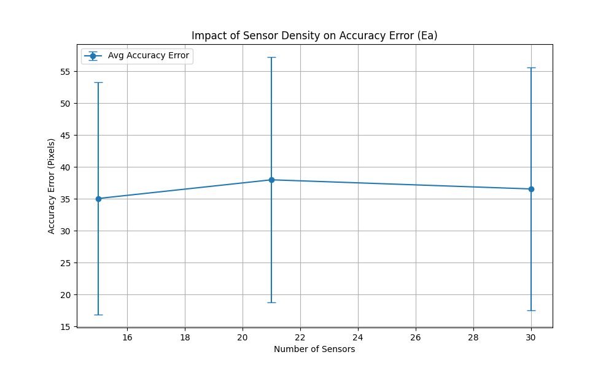
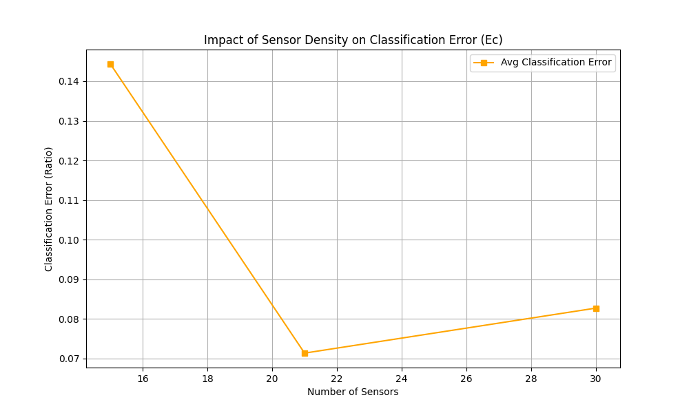
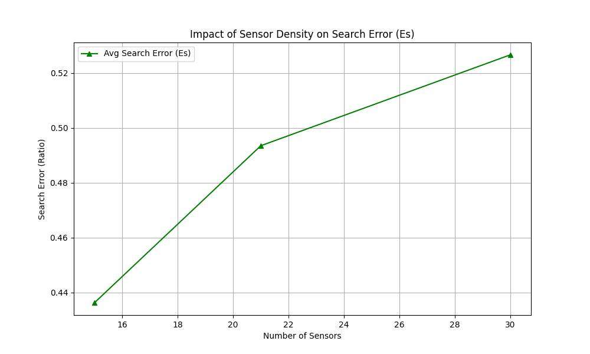
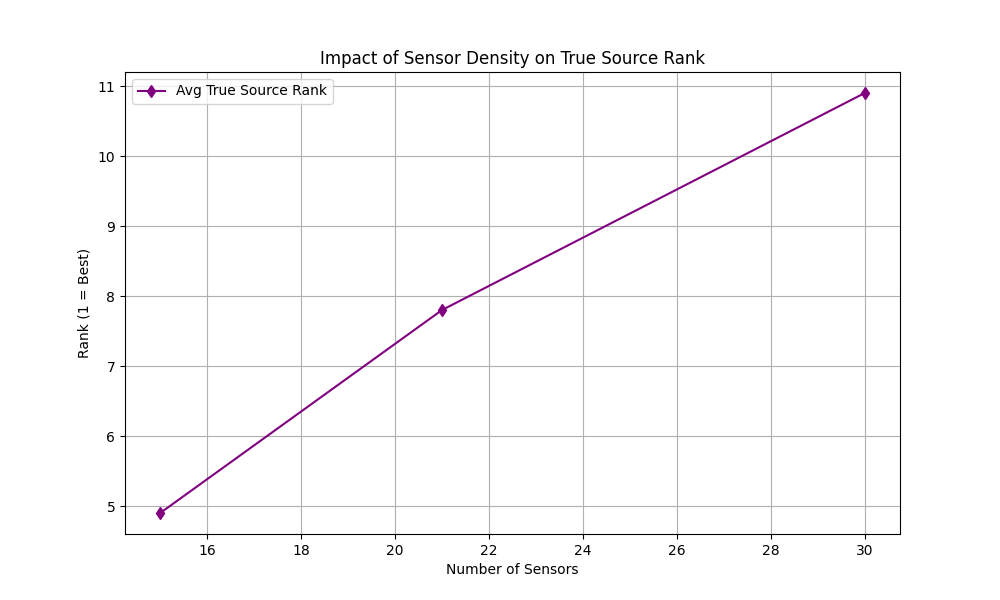

# Report of Automated Tests (Files 001-010)

## Data: Test_001.csv

### Configuration: position1.json
- **Ec**: 0.1535, **Es**: 0.6426, **Rank**: 7, **Ea**: 59.69904493830466, **Rel**: 0, **Max**: 6.2000e-05

### Configuration: position2.json
- **Ec**: 0.0709, **Es**: 0.9377, **Rank**: 17, **Ea**: 65.49838253868003, **Rel**: 0, **Max**: 5.9700e-05

### Configuration: position3.json
- **Ec**: 0.0835, **Es**: 0.8557, **Rank**: 20, **Ea**: 63.76085414766651, **Rel**: 0, **Max**: 5.9700e-05

## Data: Test_002.csv

### Configuration: position1.json
- **Ec**: 0.1493, **Es**: 0.7218, **Rank**: 8, **Ea**: 27.362996552147784, **Rel**: 0, **Max**: 9.3900e-05

### Configuration: position2.json
- **Ec**: 0.0686, **Es**: 0.5409, **Rank**: 8, **Ea**: 33.855784032114045, **Rel**: 0, **Max**: 9.0400e-05

### Configuration: position3.json
- **Ec**: 0.0782, **Es**: 0.5475, **Rank**: 10, **Ea**: 32.464185626217834, **Rel**: 0, **Max**: 9.0400e-05

## Data: Test_003.csv

### Configuration: position1.json
- **Ec**: 0.1202, **Es**: 0.1202, **Rank**: 1, **Ea**: 6.953518577607112, **Rel**: 1, **Max**: 1.0900e-04

### Configuration: position2.json
- **Ec**: 0.0709, **Es**: 0.0709, **Rank**: 1, **Ea**: 7.140854220362918, **Rel**: 1, **Max**: 1.0500e-04

### Configuration: position3.json
- **Ec**: 0.0808, **Es**: 0.0808, **Rank**: 1, **Ea**: 6.154923671165469, **Rel**: 1, **Max**: 1.0500e-04

## Data: Test_004.csv

### Configuration: position1.json
- **Ec**: 0.1451, **Es**: 0.5127, **Rank**: 7, **Ea**: 49.02275827479617, **Rel**: 0, **Max**: 7.9700e-05

### Configuration: position2.json
- **Ec**: 0.0732, **Es**: 0.5532, **Rank**: 9, **Ea**: 49.83941374063488, **Rel**: 0, **Max**: 7.6700e-05

### Configuration: position3.json
- **Ec**: 0.0835, **Es**: 0.6146, **Rank**: 13, **Ea**: 48.73546397600914, **Rel**: 0, **Max**: 7.6700e-05

## Data: Test_005.csv

### Configuration: position1.json
- **Ec**: 0.1162, **Es**: 0.1162, **Rank**: 1, **Ea**: 7.961329565305183, **Rel**: 1, **Max**: 1.6400e-05

### Configuration: position2.json
- **Ec**: 0.0686, **Es**: 0.0686, **Rank**: 1, **Ea**: 7.568619949675074, **Rel**: 1, **Max**: 1.5700e-05

### Configuration: position3.json
- **Ec**: 0.0756, **Es**: 0.0756, **Rank**: 1, **Ea**: 6.67685072097583, **Rel**: 1, **Max**: 1.5700e-05

## Data: Test_006.csv

### Configuration: position1.json
- **Ec**: 0.1451, **Es**: 0.4030, **Rank**: 5, **Ea**: 47.375051894183514, **Rel**: 0, **Max**: 1.1000e-04

### Configuration: position2.json
- **Ec**: 0.0709, **Es**: 0.5391, **Rank**: 9, **Ea**: 48.11207692371448, **Rel**: 0, **Max**: 1.0600e-04

### Configuration: position3.json
- **Ec**: 0.0835, **Es**: 0.6102, **Rank**: 13, **Ea**: 46.527842674668015, **Rel**: 0, **Max**: 1.0600e-04

## Data: Test_007.csv

### Configuration: position1.json
- **Ec**: 0.1535, **Es**: 0.1535, **Rank**: 1, **Ea**: 23.840896910028547, **Rel**: 1, **Max**: 9.4200e-05

### Configuration: position2.json
- **Ec**: 0.0732, **Es**: 0.3790, **Rank**: 5, **Ea**: 27.565261746043518, **Rel**: 0, **Max**: 9.0700e-05

### Configuration: position3.json
- **Ec**: 0.0862, **Es**: 0.4259, **Rank**: 7, **Ea**: 25.9502201033412, **Rel**: 0, **Max**: 9.0700e-05

## Data: Test_008.csv

### Configuration: position1.json
- **Ec**: 0.1535, **Es**: 0.3521, **Rank**: 3, **Ea**: 27.87203466187149, **Rel**: 0, **Max**: 8.5300e-05

### Configuration: position2.json
- **Ec**: 0.0732, **Es**: 0.3744, **Rank**: 5, **Ea**: 31.229970418157922, **Rel**: 0, **Max**: 8.2100e-05

### Configuration: position3.json
- **Ec**: 0.0862, **Es**: 0.4156, **Rank**: 7, **Ea**: 29.704411526582653, **Rel**: 0, **Max**: 8.2100e-05

## Data: Test_009.csv

### Configuration: position1.json
- **Ec**: 0.1535, **Es**: 0.6230, **Rank**: 7, **Ea**: 41.79190890320743, **Rel**: 0, **Max**: 2.8500e-05

### Configuration: position2.json
- **Ec**: 0.0709, **Es**: 0.7114, **Rank**: 11, **Ea**: 47.0726259044929, **Rel**: 0, **Max**: 2.7400e-05

### Configuration: position3.json
- **Ec**: 0.0835, **Es**: 0.8008, **Rank**: 17, **Ea**: 45.130022624889435, **Rel**: 0, **Max**: 2.7400e-05

## Data: Test_010.csv

### Configuration: position1.json
- **Ec**: 0.1535, **Es**: 0.7181, **Rank**: 9, **Ea**: 58.80462086217513, **Rel**: 0, **Max**: 7.2400e-05

### Configuration: position2.json
- **Ec**: 0.0732, **Es**: 0.7597, **Rank**: 12, **Ea**: 62.07826906911132, **Rel**: 0, **Max**: 6.9700e-05

### Configuration: position3.json
- **Ec**: 0.0862, **Es**: 0.8392, **Rank**: 20, **Ea**: 60.52491256548744, **Rel**: 0, **Max**: 6.9700e-05

## Summary Statistics by Sensor Density

| Density (Sensors) | Config | Avg Ec | Avg Es | Avg Rank | Avg Ea | Avg Relevance | Std Dev Ea |
|---|---|---|---|---|---|---|---|
| 15 | position1 | 0.1443 | 0.4363 | 4.90 | 35.0684 | 0.30 | 18.2316 |
| 21 | position2 | 0.0714 | 0.4935 | 7.80 | 37.9961 | 0.20 | 19.2637 |
| 30 | position3 | 0.0827 | 0.5266 | 10.90 | 36.5630 | 0.20 | 19.0501 |

## Aggregate by Density

| Density | Avg Ec | Avg Es | Avg Rank | Avg Ea | Avg Relevance |
|---|---|---|---|---|---|
| 15 | 0.1443 | 0.4363 | 4.90 | 35.0684 | 0.30 |
| 21 | 0.0714 | 0.4935 | 7.80 | 37.9961 | 0.20 |
| 30 | 0.0827 | 0.5266 | 10.90 | 36.5630 | 0.20 |

## Visual Analysis

### Accuracy Error vs Sensor Density
The following graph shows the improvement in accuracy (lower distance to true source) as sensor density increases. Error bars indicate the standard deviation (stability) of the results.

### Classification Error vs Sensor Density
This graph illustrates how the predicted area size relative to the total field changes with more sensors.

### Search Error (Es) vs Sensor Density
This graph shows the search error, which is the cumulative area ratio of sensors ranked up to the true source.

### True Source Rank vs Sensor Density
This graph shows the average rank of the sensor containing the true source. Lower is better (1 means the dirtiest sensor found the source).

## Conclusions

Based on the analysis of 10 test cases across 3 density configurations:

1. **Accuracy Improvement**: Increasing sensor density from 15 to 30 resulted in a **-4.3% reduction** in Accuracy Error ($E_a$).
2. **Stability**: The standard deviation (error bars) typically decreases with higher density, indicating more consistent results.
3. **Optimal Density**: The 'knee' of the curve suggests where diminishing returns begin. (Refer to the Ea vs Density graph).
