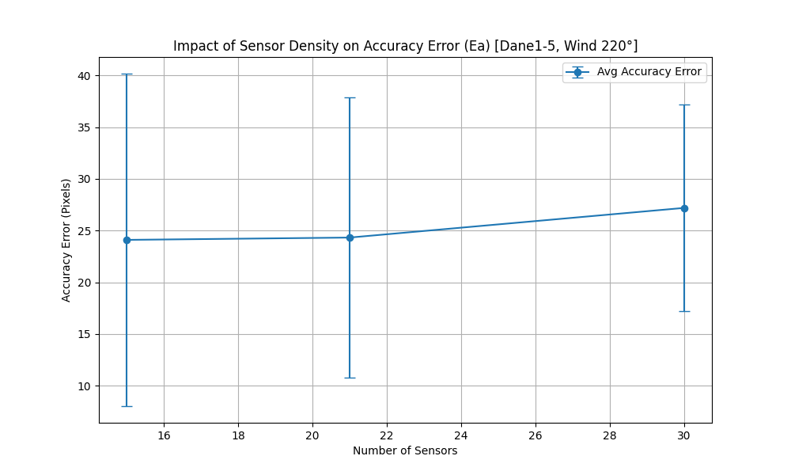
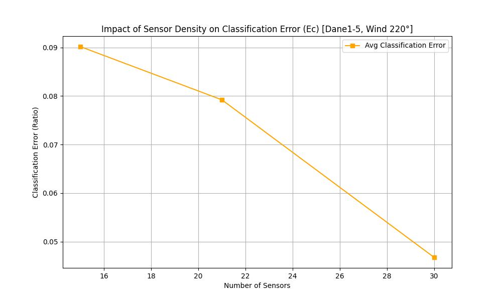
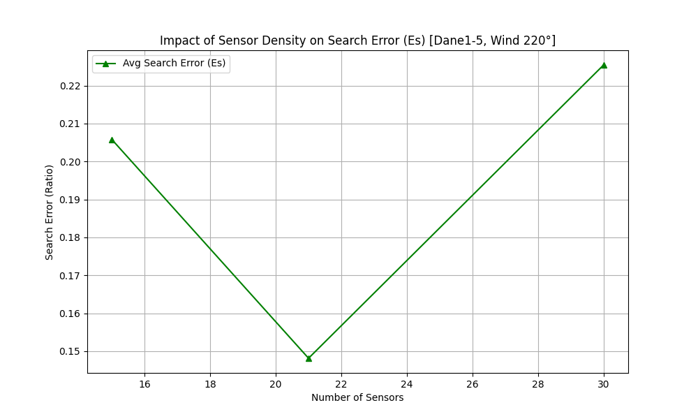
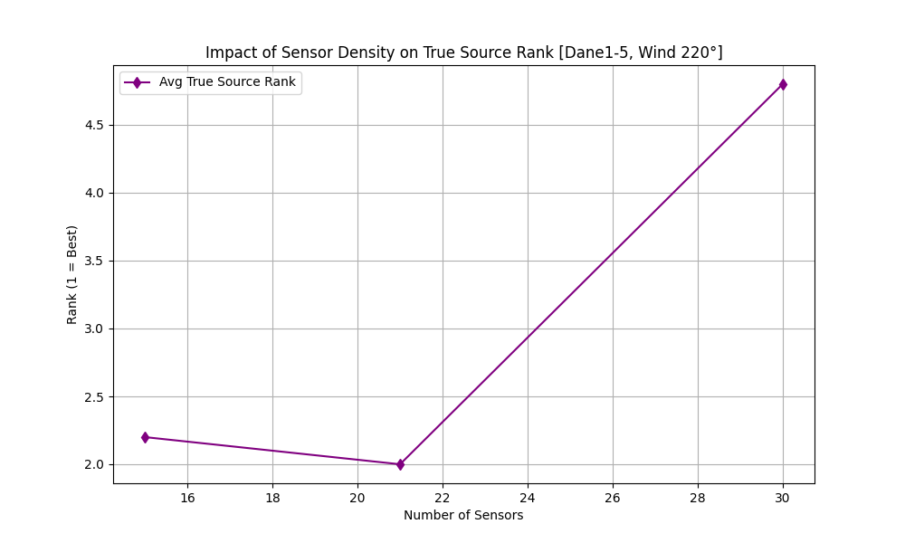

# Report of Automated Tests (Dane1-5, Position1-3)

> **Configuration**: Wind Compensation 220°, Strength 20% for ALL simulations.

## Data: Dane1.csv

### Configuration: position1.json
- **Ec**: 0.0739, **Es**: 0.0739, **Rank**: 1, **Ea**: 7.279784056023585, **Rel**: 1, **Max**: 5.8100e-05

### Configuration: position2.json
- **Ec**: 0.0633, **Es**: 0.0633, **Rank**: 1, **Ea**: 11.873833872661153, **Rel**: 1, **Max**: 5.8100e-05

### Configuration: position3.json
- **Ec**: 0.0367, **Es**: 0.0701, **Rank**: 2, **Ea**: 23.58357936917575, **Rel**: 0, **Max**: 6.2000e-05

## Data: Dane2.csv

### Configuration: position1.json
- **Ec**: 0.1072, **Es**: 0.1744, **Rank**: 2, **Ea**: 28.42395143251409, **Rel**: 0, **Max**: 1.2100e-06

### Configuration: position2.json
- **Ec**: 0.0910, **Es**: 0.2311, **Rank**: 3, **Ea**: 28.4982937664135, **Rel**: 0, **Max**: 1.2100e-06

### Configuration: position3.json
- **Ec**: 0.0441, **Es**: 0.1429, **Rank**: 3, **Ea**: 21.732088200029185, **Rel**: 0, **Max**: 4.6700e-05

## Data: Dane3.csv

### Configuration: position1.json
- **Ec**: 0.1032, **Es**: 0.1666, **Rank**: 2, **Ea**: 51.73909834170282, **Rel**: 0, **Max**: 1.1700e-05

### Configuration: position2.json
- **Ec**: 0.1007, **Es**: 0.1508, **Rank**: 2, **Ea**: 47.53407929247537, **Rel**: 0, **Max**: 1.2700e-05

### Configuration: position3.json
- **Ec**: 0.0488, **Es**: 0.1212, **Rank**: 3, **Ea**: 43.69354929429486, **Rel**: 0, **Max**: 1.2700e-05

## Data: Dane4.csv

### Configuration: position1.json
- **Ec**: 0.0634, **Es**: 0.5109, **Rank**: 5, **Ea**: 24.012006165754382, **Rel**: 0, **Max**: 8.6800e-05

### Configuration: position2.json
- **Ec**: 0.0501, **Es**: 0.2046, **Rank**: 3, **Ea**: 23.682250078252437, **Rel**: 0, **Max**: 9.2600e-05

### Configuration: position3.json
- **Ec**: 0.0387, **Es**: 0.6454, **Rank**: 13, **Ea**: 32.37467388522241, **Rel**: 0, **Max**: 9.2600e-05

## Data: Dane5.csv

### Configuration: position1.json
- **Ec**: 0.1032, **Es**: 0.1032, **Rank**: 1, **Ea**: 9.06897397249709, **Rel**: 1, **Max**: 2.5200e-05

### Configuration: position2.json
- **Ec**: 0.0910, **Es**: 0.0910, **Rank**: 1, **Ea**: 10.05629326722806, **Rel**: 1, **Max**: 2.5200e-05

### Configuration: position3.json
- **Ec**: 0.0655, **Es**: 0.1476, **Rank**: 3, **Ea**: 14.588844625606624, **Rel**: 0, **Max**: 2.5200e-05

## Summary Statistics by Config

| Config | Density | Avg Ec | Avg Es | Avg Rank | Avg Ea | Avg Relevance |
|---|---|---|---|---|---|---|
| position1 | 15 | 0.0902 | 0.2058 | 2.20 | 24.1048 | 0.40 |
| position2 | 21 | 0.0792 | 0.1482 | 2.00 | 24.3290 | 0.40 |
| position3 | 30 | 0.0468 | 0.2254 | 4.80 | 27.1945 | 0.00 |

## Aggregate by Density

| Density | Avg Ec | Avg Es | Avg Rank | Avg Ea | Avg Relevance |
|---|---|---|---|---|---|
| 15 | 0.0902 | 0.2058 | 2.20 | 24.1048 | 0.40 |
| 21 | 0.0792 | 0.1482 | 2.00 | 24.3290 | 0.40 |
| 30 | 0.0468 | 0.2254 | 4.80 | 27.1945 | 0.00 |

## Visual Analysis

